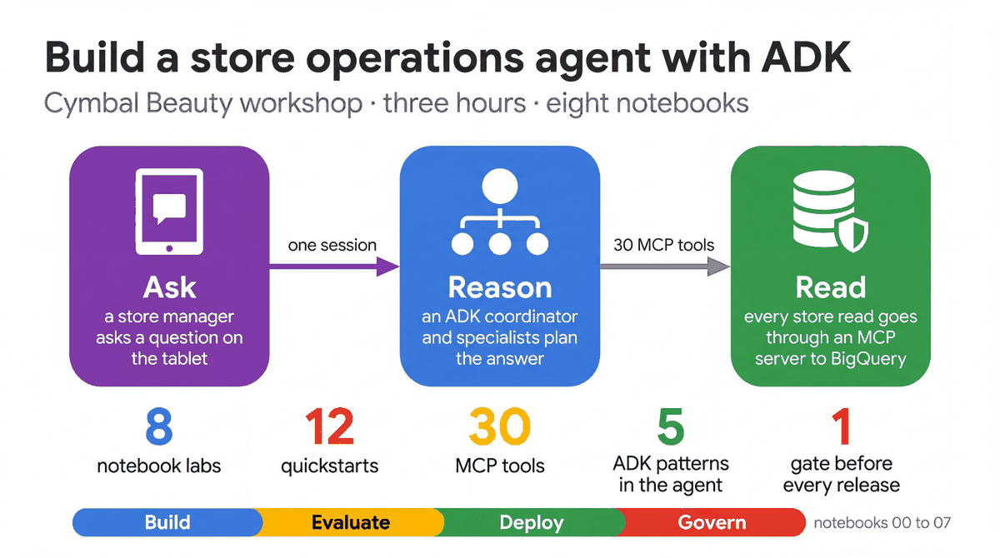
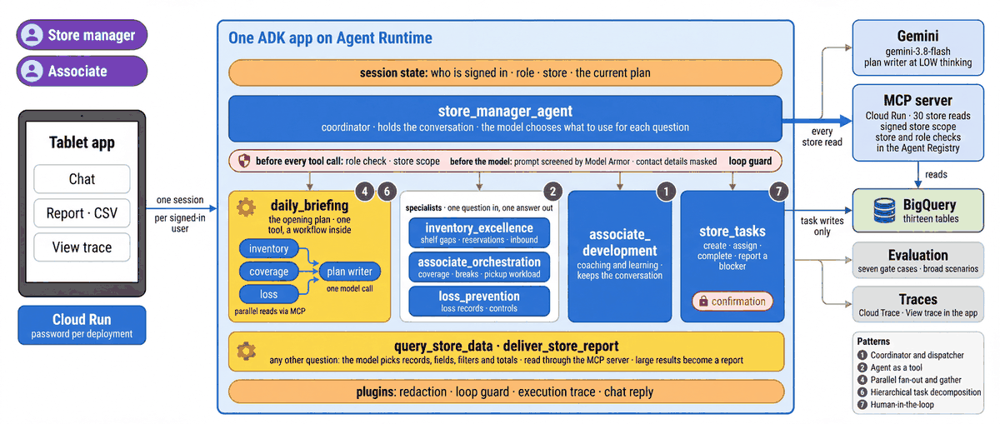

# Cymbal Beauty ADK workshop

Build and run a store operations agent with the Agent Development Kit (ADK). The agent helps a store manager and
their team plan the day, cover pickup orders, keep shelves stocked, review loss and coach associates. You follow
it from the data behind an answer to the evaluations, the deployment and the controls around it.

**[Start the first notebook](notebooks/00_workspace_and_platform.ipynb)** ·
[Notebook labs](notebooks/README.md) · [Quickstarts](quickstarts/README.md) ·
[Tablet app](frontend/README.md) · [Architecture](docs/ARCHITECTURE.md)



## The workshop

The workshop is eight notebooks, run in order over three hours. Each notebook calls the Google Cloud and ADK
SDKs directly, with a short explanation before every step.

| Notebook | What you do |
|---|---|
| [00 · Get started with the workshop and the agent platform](notebooks/00_workspace_and_platform.ipynb) | Check your packages, call Gemini on Vertex AI, read the agent's configuration and send a question to the deployed agent. |
| [01 · Explore and load the store data](notebooks/01_store_data.ipynb) | Generate and profile the thirteen tables, look at one store, load the data into BigQuery in your namespace and query it with SQL. |
| [02 · Multi-agent patterns](notebooks/02_agent_patterns.ipynb) | Build the agent tree, see a specialist consulted as a tool and three readers run in parallel, and build a sequential pipeline of your own. |
| [03 · Tools, reports and sessions](notebooks/03_tools_and_workflows.ipynb) | Read a tool's declaration, call the tools directly, see the store and role boundary, deliver a report as CSV and keep state across turns. |
| [04 · Evaluate and observe](notebooks/04_evaluate_and_observe.ipynb) | Read the evaluation gate, score answers with a custom metric, run the gate and a multi-turn test, draw a turn's spans and publish results to Vertex AI. |
| [05 · Deploy and promote](notebooks/05_deploy_and_promote.ipynb) | Package the agent, create or update your engine on Agent Runtime, query it, split traffic between revisions and read the release pipeline. |
| [06 · Governance](notebooks/06_governance.ipynb) | See scope and role checks refuse requests, test the SQL guard, stop at a confirmation, screen prompts with Model Armor and list Agent Registry entries. |
| [07 · Cost and tokens](notebooks/07_cost_and_tokens.ipynb) | Record the tokens and seconds of every model call in a turn, price a month of use and compare thinking levels. |

## Run the notebooks

You need Python 3.12, [`uv`](https://docs.astral.sh/uv/) and the Google Cloud CLI. Clone the repository, install
the dependencies and start JupyterLab:

```bash
git clone https://github.com/mr394729/cymbal-beauty-adk-workshop.git
cd cymbal-beauty-adk-workshop
uv sync --all-extras
uv run jupyter lab notebooks/
```

Open `00_workspace_and_platform.ipynb` with the repository's Python kernel. The notebooks run against your own
Google Cloud project and your own namespace, so several people can share one project. [SETUP.md](SETUP.md) covers
sign-in, the APIs to enable and choosing a namespace. The same checkout works in VS Code and Vertex AI Workbench.

## The store agent



A coordinator agent holds the conversation. It consults three specialists as tools (shelf availability, team
coverage, loss prevention), hands coaching conversations to a coaching agent, runs a fixed workflow for the opening
plan, and passes task requests to an agent that asks for approval before it writes. The model chooses what to use
for each question; code checks the signed-in store and role before every tool call.

The deployed agent reads every store record through an authenticated MCP server on Cloud Run
([services/store_mcp](services/store_mcp/)), which runs the same checks again. Task writes, sign-in and memory stay
in the agent. When you run the agent locally, in a notebook or with `adk web`, it reads BigQuery directly with your
own credentials.

Try it in the ADK developer UI:

```bash
uv run adk web agents --port 8000
```

Or in the tablet app, locally or against your deployed engine:

```bash
uv run python frontend/server.py --target local --port 8080
uv run python frontend/server.py --target agent-engine --env dev --port 8080
```

## Quickstarts

Twelve small agents, one idea each, with their own README, diagram and walkthrough notebook. They run on the same
store data. See the [quickstart catalog](quickstarts/README.md).

| Quickstart | Idea |
|---|---|
| [01](quickstarts/01-hello-tool-agent/) | An agent with one function tool |
| [02](quickstarts/02-rag-knowledge-agent/) | Answer from store procedures with Vertex AI Search |
| [03](quickstarts/03-form-completion-agent/) | Complete a form and confirm before submitting |
| [04](quickstarts/04-external-api-agent/) | Call an external API |
| [05](quickstarts/05-data-analyst-agent/) | Analyze store data with the BigQuery tools |
| [06](quickstarts/06-memory-agent/) | Remember preferences with state and Memory Bank |
| [07](quickstarts/07-document-extraction-agent/) | Extract and check a promotion signage proof |
| [08](quickstarts/08-mcp-tools-agent/) | Connect an agent to store tools over MCP |
| [09](quickstarts/09-guardrails-agent/) | Guardrails as code with callbacks and plugins |
| [10](quickstarts/10-multi-agent-router/) | Route between specialist agents |
| [11](quickstarts/11-ambient-event-agent/) | React to a store event and publish a recommendation |
| [12](quickstarts/12-a2a-agent/) | Delegate to another team's agent over A2A |

## Repository layout

| Folder | What it holds | Notebook |
|---|---|---|
| [agents/cymbal_store_ops](agents/cymbal_store_ops/) | The coordinator, specialists, workflow, tools, callbacks and prompts | 02, 03, 06 |
| [data](data/) | The dataset generator and BigQuery schemas | 01 |
| [services/store_mcp](services/store_mcp/) | The MCP server that serves the store reads | 05, 06 |
| [eval](eval/) and [tests](tests/README.md) | Evaluation sets, custom metrics and automated tests | 04 |
| [journeys](journeys/README.md) | Multi-turn conversation tests | 04 |
| [deployment](deployment/) and [cloudbuild](cloudbuild/) | Deployment to Agent Runtime and the release pipeline | 05 |
| [frontend](frontend/README.md) | The tablet app ([how it is built](frontend/ARCHITECTURE.md)) | 03 |
| [quickstarts](quickstarts/README.md) | Twelve focused examples | |
| [skills](skills/README.md) | Skills for coding agents working in this repository | |
| [docs](docs/README.md) | Architecture, patterns, governance and operations | |

Common commands are in [docs/COMMANDS.md](docs/COMMANDS.md). Running the session:
[facilitator runbook](docs/FACILITATOR_RUNBOOK.md). For coding agents and contributors: [AGENTS.md](AGENTS.md).
