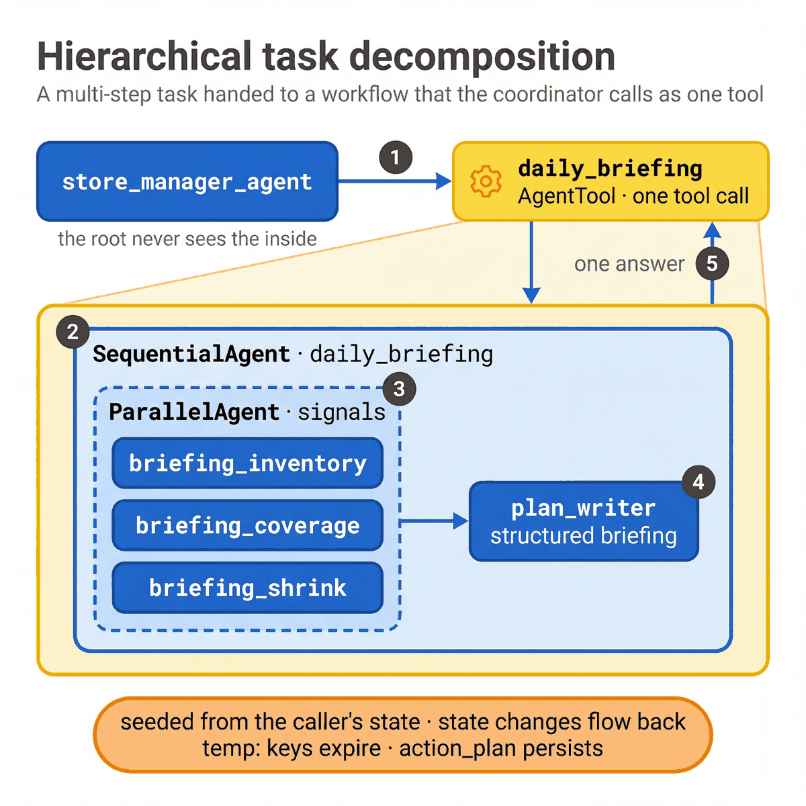

# Specialists and workflows

[Application](../README.md) · [Notebook 02](../../../notebooks/02_agent_patterns.ipynb)

| Agent | Pattern | Responsibility |
|---|---|---|
| Inventory excellence | Single-turn consultation | Stock, reservations, availability, supply and inventory reports |
| Associate orchestration | Single-turn consultation | Roster, pickup workload and coverage constraints |
| Loss prevention | Single-turn consultation | Loss components, controls and reconciliation evidence |
| Associate development | Conversation hand-off | Team coaching or the signed-in associate's own development |
| Store tasks | Task agent | Clarify, propose, confirm and apply supported manager task changes |
| Daily briefing | Parallel reads then sequential synthesis | Combine three scoped evidence groups into priorities |

Each `make_*` factory creates fresh agents. Specialist input schemas carry the request and constraints;
store identity remains in trusted session state. Read [the architecture](../../../docs/ARCHITECTURE.md)
for source links and state contracts.
