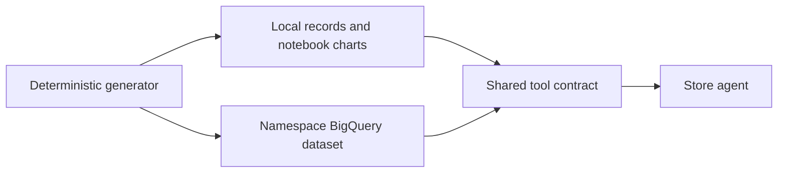

# Store data

[Workshop home](../README.md) · [Notebook 01](../notebooks/01_store_data.ipynb) · [Data contracts](../docs/DATA_REQUIREMENTS.md)

The dataset represents the fictional retailer Cymbal Beauty. The same generated records support notebook
exploration, local tool checks and the namespace's BigQuery tables.

| Source | Purpose |
|---|---|
| [generate.py](generate.py) | Seeded catalog, store and transaction records |
| [fixtures.py](fixtures.py) | Fixed reference records for repeatable checks |
| [schemas](schemas/) | BigQuery table schemas |
| [Operational fixtures](../agents/cymbal_store_ops/operations_fixtures.py) | Reservations, controls, learning and other contextual records |
| [load.sh](load.sh) | Load generated files into a configured namespace |
| [teardown.sh](teardown.sh) | Explicit dataset cleanup |

## Explore before loading

Start with notebook 01 to inspect size, distribution and coverage without creating cloud resources.
Catalog and inventory coverage is broader than the detailed operational snapshots. Missing evidence must
remain unknown rather than becoming a zero, an available associate or a completed stock check.

`uv run python data/generate.py && bash data/load.sh --env dev` generates and loads your namespace's data after [setup](../SETUP.md).
Generated files in `out/` are ignored. Loading/resetting fixtures can replace workshop state; it is not part
of the default notebook Run All.

When extending the data, update schema, generator, backend behavior and factual evaluation expectations together.
