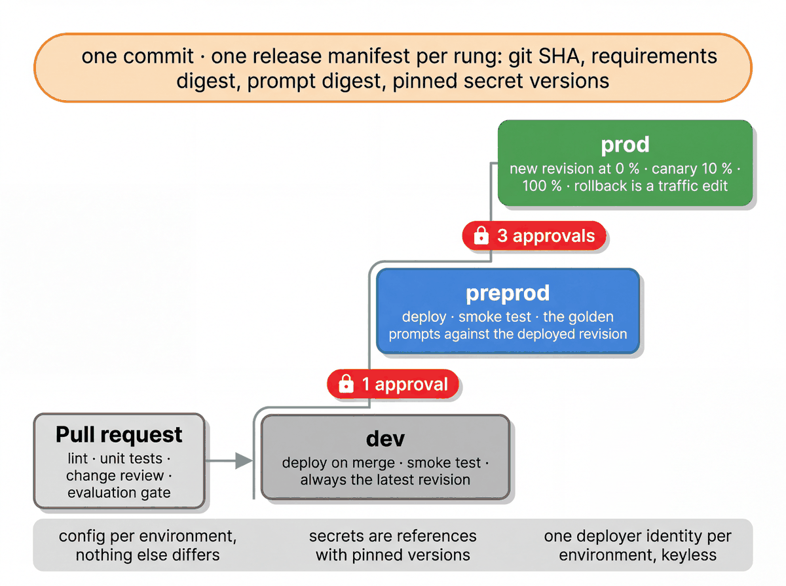

# Deploy the workshop application

[Workshop home](../README.md) · [Notebook 05](../notebooks/05_deploy_and_promote.ipynb) · [Cloud Build](../cloudbuild/README.md)

The scripts package a release, deploy it to Agent Runtime, test a named revision and manage promotion.

| Script | Responsibility |
|---|---|
| [release.py](release.py) | Record source and dependency/configuration digests |
| [deploy.py](deploy.py) | Create or update the namespace's environment engine |
| [smoke.py](smoke.py), [remote_eval.py](remote_eval.py) | Exercise a deployed revision |
| [traffic.py](traffic.py) | Inspect revisions, promote traffic and roll back |
| [deploy_frontend.sh](deploy_frontend.sh) | Deploy the tablet Cloud Run service |
| [deploy_quickstart.py](deploy_quickstart.py) | Deploy a selected standalone example |
| [register_gemini_enterprise.py](register_gemini_enterprise.py) | Register the agent with a configured enterprise application |
| [iam](iam/) | Project identities, federation and pipeline triggers |
| [teardown.py](teardown.py) | Explicit runtime cleanup |

After [cloud setup](../SETUP.md), inspect `uv run python deployment/release.py && uv run python deployment/deploy.py --env dev --release release.json --dry-run` before `uv run python deployment/release.py && uv run python deployment/deploy.py --env dev --release release.json`.
The engine is resolved by namespace and environment labels; the ignored local deployment-info file records
the last result. Preprod and production run through the configured approval pipeline.

These scripts do not establish that a live pipeline connection already exists. Review actual build and
revision evidence before a workshop demonstration. Contributor rules are in [AGENTS.md](AGENTS.md).
