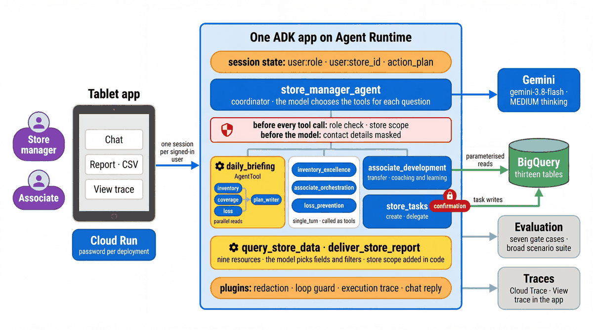
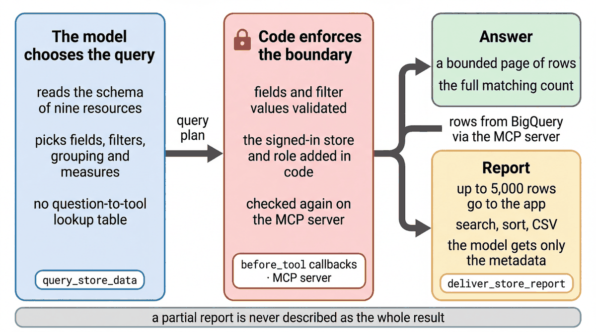

# Store operations architecture

[Workshop](../README.md) · [Agent patterns notebook](../notebooks/02_agent_patterns.ipynb) ·
[Tools and workflows notebook](../notebooks/03_tools_and_workflows.ipynb)

The tablet app and notebooks use the same ADK application. The coordinator can read data directly,
consult a specialist, run the opening-briefing workflow or hand over a conversation. It chooses capabilities
for the current request; the scenario chips supply example questions, not routing rules.

The diagrams below describe the checked-in implementation; each is drawn from the code by the brief that sits
next to it under [docs/diagrams/prompts](diagrams/prompts/README.md).

## 0. System overview

| Component | Implementation |
|---|---|
| Tablet experience | [FastAPI server](../frontend/server.py) and [browser application](../frontend/static/app.js), served locally or on Cloud Run; [how it connects to the agent](../frontend/ARCHITECTURE.md) |
| Notebook labs | [Eight notebooks](../notebooks/README.md) calling repository code, with optional live operations |
| ADK application | [agent.py](../agents/cymbal_store_ops/agent.py): root agent, plugins, resumability and context caching |
| Agent execution | Local ADK runner or [Agent Runtime deployment](../deployment/deploy.py) |
| Model | [models.py](../agents/cymbal_store_ops/models.py) pins the configured Gemini client to its model location; dev config uses `gemini-3.8-flash`, global and MEDIUM thinking |
| Store records | [BigQuery backend](../agents/cymbal_store_ops/tools/backends/bigquery.py) for the participant namespace; a local backend supports notebook exploration and tests |
| Identity | The frontend seeds persona identity in session state. Cloud services use their configured service accounts, or the engine's own [Agent Identity](GOVERNANCE.md#identity-registry-and-gateway) when created that way. |
| Content screening | [Model Armor](GOVERNANCE.md#model-armor) in a `before_model_callback` when `MODEL_ARMOR_TEMPLATE` is set: a matched prompt is refused before the model runs |
| Shared read tools | The [MCP service](patterns/mcp-service.md) on Cloud Run serves six of the read tools to any agent, with a signed store scope; the store agent uses it when `CYMBAL_MCP_URL` is set |

The runtime region and model endpoint are separate settings. Tools obtain store and user scope from session
state. They do not treat a store ID typed in chat as authentication.

## 1. store_manager_agent, the chat root

The root is a conversational `LlmAgent`. Its tools include flexible queries, whole-store inventory summaries
and pages, exact product stock, catalog search and reviews, pickup demand, replenishment, merchandising,
loss evidence and personal work. Specialist consultation is available when the question benefits from it.

[Source: agent.py](../agents/cymbal_store_ops/agent.py) · [Instructions](../agents/cymbal_store_ops/prompts/root.md)

| Route | ADK structure | Result |
|---|---|---|
| Direct read or query | Function tools | Records, aggregates or bounded evidence for the answer |
| Inventory, coverage or loss analysis | `single_turn` specialist | Findings returned to the coordinator |
| Opening briefing | `AgentTool` around a sequential workflow | Parallel source reads followed by one plan writer |
| Development conversation | Chat-agent transfer | The development agent continues the conversation |
| Manager task action | Task-mode agent | Read, propose, confirm, apply and hand back |
| Associate task update | Personal-work tools | Confirmed completion or blocker reporting on the signed-in associate's own task |

The [chat reply plugin](../agents/cymbal_store_ops/chat_reply.py) separates readable text from model-generated
follow-up suggestions. Supported work supplies three to five activities; refusals and cancellations clear them.
Completed consultant internals are removed from later model inputs when their returned findings are retained;
the recorded session events and traces remain intact.

### Queries and reports

[store_query.py](../agents/cymbal_store_ops/tools/store_query.py) exposes inventory, orders, tasks, traffic,
loss, feedback, reviews, deliveries and roster records. The model chooses fields, filters, grouping, measures
and ordering. Code validates the query and enforces its store, role and ownership limits. This interface does
not accept raw SQL.

Ordinary query pages contain up to 100 rows and full matching counts. A report delivers up to 5,000 rows to
`ui:report`, with explicit completeness. The browser provides search, sorting and CSV download over those
rows; the model receives metadata. A successful sole `deliver_store_report` call finishes without another
model rewrite. Mixed tool calls retain coordinator synthesis.

## 2. inventory_excellence

[Source](../agents/cymbal_store_ops/sub_agents/inventory_excellence.py) ·
[Instructions](../agents/cymbal_store_ops/prompts/inventory_excellence.md)

A `single_turn` consultant receives the request and optional product/store scope. It can inspect whole-store
inventory, query records, read stock and pickup demand, find locations and nearby stock, and check inbound
supply and open tasks. [get_inventory_context](../agents/cymbal_store_ops/tools/inventory_context.py) gathers
related evidence concurrently and preserves reservation and allocation uncertainty.

The specialist returns findings in `last_osa`. It can explain a store-wide question as well as a product
exception. Recorded stock, available-to-promise stock and physical observations remain distinct facts.

## 3. associate_orchestration

[Source](../agents/cymbal_store_ops/sub_agents/associate_orchestration.py) ·
[Instructions](../agents/cymbal_store_ops/prompts/associate_orchestration.md)

A `single_turn` consultant receives the request, planning window and optional focus. Its tools cover the clock,
traffic/backlog, roster and current assignments, coverage requirements, structured queries and
[pickup workload](../agents/cymbal_store_ops/tools/pickup_workload.py).

The workload tool supplies per-order scheduling estimates and exceptions. The specialist interprets that
evidence alongside breaks, assignments and coverage needs. It returns `last_coverage`; it does not change
someone's assignment merely by recommending it.

## 4. loss_prevention

[Source](../agents/cymbal_store_ops/sub_agents/loss_prevention.py) ·
[Instructions](../agents/cymbal_store_ops/prompts/loss_prevention.md)

A `single_turn` consultant receives the request, optional product and look-back period. Its tools cover loss
signals, product search, sales patterns, task history, control records, reconciliation and structured queries.
It returns `last_shrink`.

Unknown loss, damage, adjustments and return anomalies remain separate components. A control defect is
not proof of the cause of a loss. Completeness and missing evidence affect what the agent can conclude.
Recommendations do not alter the loss ledger or create an external maintenance ticket.

## 5. associate_development

[Source](../agents/cymbal_store_ops/sub_agents/associate_development.py) ·
[Instructions](../agents/cymbal_store_ops/prompts/associate_development.md)

A chat sub-agent receives a conversation transfer. It reads coaching context and learning options, then
returns a structured chat reply with relevant next activities. Personal tools enforce the distinction between
manager access and an associate's own development information.

This is a continuing conversation, unlike a single-turn consultation. The agent does not make HR or disciplinary
decisions, treat skills as completed certifications, or enroll someone in training.

## 6. store_tasks

[Manager task agent](../agents/cymbal_store_ops/sub_agents/store_tasks.py) ·
[Manager task tools](../agents/cymbal_store_ops/tools/domain_tools.py) ·
[Associate task tools](../agents/cymbal_store_ops/tools/personal_tools.py)

The task-mode agent reads existing work and proposes creation or delegation. ADK pauses for confirmation;
the tool validates scope and permission before writing. Idempotency protects against duplicate changes on
retries. The task agent hands back after completion or cancellation.

Associates use separate tools to report completion or a blocker for their own assigned tasks, with ownership
checks and confirmation. Neither path moves inventory, updates pickup-order status or writes to HR systems.

## 7. daily_briefing

[Workflow](../agents/cymbal_store_ops/sub_agents/daily_briefing.py) ·
[Source readers](../agents/cymbal_store_ops/sub_agents/briefing_signals.py) ·
[Fact projection](../agents/cymbal_store_ops/sub_agents/briefing_facts.py)

`BriefingTool` wraps a `SequentialAgent`. First, a `ParallelAgent` runs three `BriefingSignals` code branches:

| Branch | Evidence |
|---|---|
| Inventory | Shelf exceptions, pickup demand, open tasks, merchandising work and focused inventory context |
| Coverage | Traffic, roster, feedback, coverage requirements and per-order pickup feasibility |
| Loss | Loss signals, relevant product task history and controls |

These are concurrent code readers, not three language models. The writer receives the caller's request and
one projected copy of the source facts. It uses the configured model and thinking level to choose up to three
priorities and generate three to five follow-up activities. Existing assignments, deadlines, reservations,
errors and unknowns remain decision inputs.

The writer emits a compact `BriefingDraft` containing ordered decisions and next activities. A code finalizer attaches the signed-in store, configured source observation clock and numbered priorities to the canonical `BriefingReply`/`ActionPlan`. The legacy summary is the first headline and is not repeated in the displayed answer; optional task-note prose is no longer generated. For a successful sole briefing call, code
formats the writer's summary and evidence into chat and sets `skip_summarization`. There is no second
coordinator rewrite. A mixed tool-call batch keeps synthesis active. The structured `action_plan` and recorded
execution trace remain available for follow-ups and evaluation.

## 8. policy_lookup, retrieval over the SOPs

[Retrieval tool](../agents/cymbal_store_ops/tools/policy_lookup.py) ·
[Retrieval source example](../quickstarts/02-rag-knowledge-agent/README.md)

The root registers `policy_lookup` only when `SOP_DATA_STORE` is configured. It retrieves operating-procedure
content from Vertex AI Search. This connection requires its own data-store setup and validation. Its presence
in the source does not establish that a particular deployment has a configured retrieval service.

## 9. Guardrails map

| Boundary | Enforcement |
|---|---|
| User text | Ingress and model callbacks redact recognized email addresses and phone numbers from user text. |
| Store scope | Tool callbacks and backend predicates use the signed-in store; district-manager access is handled explicitly. |
| Role and ownership | Restricted operations and personal tools check role and assignee identity in code. |
| Query contract | Allowlisted resources and fields, parameterized values, bounded output and completeness metadata. |
| Writes | Dedicated task tools, confirmation, permission checks and idempotency. |
| Repeated work | The loop guard limits model calls and repeated identical tool calls per request. |
| Evidence | Full session events are retained; UI traces contain bounded, redacted snapshots and measured timings. |
| Content | Model Armor screens each prompt for injection, jailbreak, card numbers and harmful content when the template is configured; the decision is a span on the trace. |

[Callbacks](../agents/cymbal_store_ops/callbacks.py) · [Plugins](../agents/cymbal_store_ops/plugins.py) ·
[Trace instrumentation](../agents/cymbal_store_ops/trace.py)

Prompt instructions support these boundaries; they do not replace enforcement in code. A raw-SQL toolset
exists in the separate analyst example, with its own guard. It is not a root store-agent capability.

## 10. Shared project and namespaces

[Configuration](../agents/cymbal_store_ops/config.py) · [Shared-project reference](SHARED_PROJECT.md)

Each participant's namespace identifies their datasets and deployments. User/store/role scope identifies
which records a conversation may access within that environment. These are different boundaries.
Shared cloud identities and quotas are described in the setup reference; a namespace alone is not a separate
Google Cloud project or IAM principal.

Release and promotion are covered in [notebook 05](../notebooks/05_deploy_and_promote.ipynb). The repository
supplies pipeline configuration; a working repository connection, target environments and approval identities
must be verified before a live promotion demonstration.

## 11. The MCP service

[Hosted MCP service](patterns/mcp-service.md) · [Client and server example](../quickstarts/08-mcp-tools-agent/README.md)

The deployed agent reads store data only through `services/store_mcp/` on Cloud Run, listed in the Agent
Registry. The server registers the 30 reads in `agents/cymbal_store_ops/mcp_catalog.py` from the agent's own
functions, so names, arguments and descriptions match, and it runs the agent's store and role checks itself.
With `CYMBAL_MCP_URL`, `CYMBAL_MCP_AUDIENCE`, `CYMBAL_MCP_CALLER_SERVICE_ACCOUNT` and a pinned scope secret on
the engine, `make_root_agent` swaps each agent's local reads for its own `McpToolset`
(`agents/cymbal_store_ops/mcp_connection.py`); the briefing readers, report delivery and the end-of-day dashboard
call the server from code. Every call carries a Google ID token for the service and a signed, three-minute scope
with the session's user, store and role (`mcp_auth.py`), and the service verifies both before reading.
`deployment/deploy.py` refuses to deploy without the MCP settings. Running the agent locally (notebooks,
`adk web`) reads BigQuery directly with your own credentials. Task writes, sign-in, memory and Vertex AI Search
stay in the agent. The pattern page has the request flow, the measured overhead and the mapping onto an
enterprise API gateway with on-behalf-of tokens.

Quickstart 08 is the small, local version of the same idea: a stdio MCP server whose client stamps the signed-in
store before calling it.
