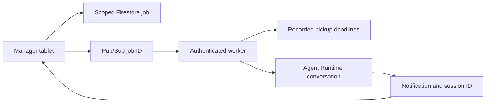

# Store events and notifications

An authenticated manager can request analysis of the store's recorded pickup deadlines. The frontend creates a scoped Firestore job and publishes its ID to Pub/Sub. An authenticated push worker reads the source records and asks the deployed store agent to assess their operational impact. The answer, execution trace and suggested activities belong to a real ADK conversation that the manager can open and continue.



The trigger observes the current dataset snapshot. It does not invent an incoming order, changed inventory balance or live clock transition. The event carries the source `as_of` time, recorded order IDs, quantities and promises, plus a completeness flag. The model chooses any further operational reads and generates the alert; code does not provide a canned answer.

## Frontend integration

Authenticate the browser and call the existing owned-session check first. Pass only server-derived ownership and session state:

```python
from agents.cymbal_store_ops.events.api import enqueue_event, list_notifications, mark_read

job = await enqueue_event(owner, "manager", origin_session_id, session["state"], request_id)
inbox = await list_notifications(owner, "manager")
await mark_read(owner, "manager", job_id)
```

A stable request ID makes submission retries idempotent. Pub/Sub receives only `{job_id}`; it cannot provide a different store, persona, message or identity. Opening a completed notification restores `analysis_session_id` through the normal owned-session endpoint. No special chat-response rendering is required.

## State and boundaries

The worker copies the signed identity into a new session and sets `_frontend_owner`, `_frontend_persona`, `_event_job_id` and `_event_initial_message_sha256`. The root callback recognizes that exact initial message before redaction and blocks operational writes throughout its invocation, including nested task and AgentTool calls. Invocation state and task-local context preserve the boundary when a child receives different user content. A later human message in the same conversation follows the existing confirmation rules. The hash does not authenticate a user; it identifies the worker's initial analysis request inside an already trusted session.

Firestore transaction leases ensure concurrent Pub/Sub deliveries do not start duplicate analyses. A completed or failed job is acknowledged without rerunning the agent. If a worker dies after beginning a model invocation, a later delivery marks the job interrupted and retains its analysis session instead of blindly replaying the request. A lost lease cannot overwrite a newer worker's result. No workflow path changes inventory or pickup records.

The worker reuses the chat stream reducer, so internal agent notes do not become duplicate public answers. Saved trace spans are bounded to 100 spans and 450 KB with an explicit truncation flag; full events remain in the ADK session. Failed source reads or agent calls appear as failed notifications, never as fabricated analysis.

## Configuration and deployment

Shared frontend configuration: `EVENTS_PROJECT`, `EVENTS_DATABASE`, `EVENTS_COLLECTION` and `EVENTS_TOPIC`. Worker-only configuration additionally includes `EVENTS_ENGINE`, `EVENTS_PUSH_AUDIENCE`, `EVENTS_PUSH_SA`, and the normal project/namespace/environment settings for scoped source reads.

`deployment/events_deploy.py` prints its resource plan by default. With `--apply`, it provisions only the named dev database, topic, push identity, inbox index, worker and subscription. `--build` builds `services/store_events/Dockerfile`. The database is a dedicated `cymbal-events-<namespace>-dev`, never `(default)`.

The frontend can publish to the event topic. Frontend and worker identities receive Firestore access conditioned to the named database. The push identity can invoke this worker only; Pub/Sub's service agent can mint its token. Cloud Run requires authentication and the application verifies the token's audience, expected service-account email and verified-email claim.

No event should be submitted until the engine revision with the initial-message write guard is deployed. Verification covers duplicate delivery, scoped inbox access, generated answer/activities, actual trace, and restoration of the analysis conversation.

## References

- [Authenticated Pub/Sub push](https://docs.cloud.google.com/pubsub/docs/authenticate-push-subscriptions)
- [Pub/Sub with Cloud Run](https://docs.cloud.google.com/run/docs/tutorials/pubsub)
- [Named Firestore databases and access conditions](https://docs.cloud.google.com/firestore/docs/manage-databases)
