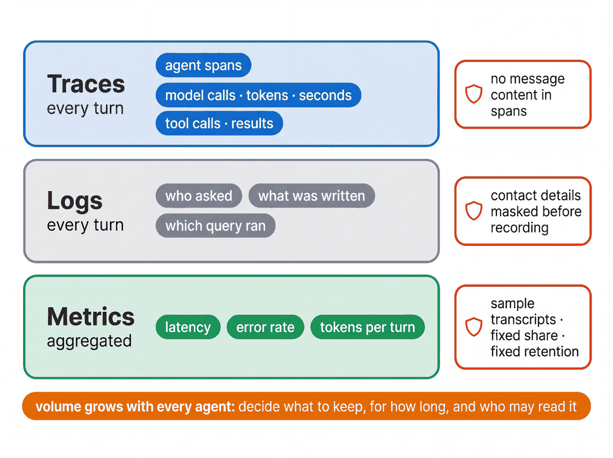

# Observability

One user turn is one **trace**; every model call, tool call and sub-agent hand-off is a **span** inside it.
ADK emits these as OpenTelemetry spans; `deployment/deploy.py` turns telemetry on with
`GOOGLE_CLOUD_AGENT_ENGINE_ENABLE_TELEMETRY=true`, so the same turn you watched in the developer UI is readable in
Cloud Trace next to the engine's logs. It does not pass the older `AdkApp(enable_tracing=True)`, because that flag
also sets `ADK_CAPTURE_MESSAGE_CONTENT_IN_SPANS=true` and copies prompts and tool results into every span.

## Locally

- `uv run adk web agents --port 8000`: the Events tab is the trace (each event carries the agent, the tool call and the state delta).
- `[logging_plugin]` lines in the terminal come from ADK's `LoggingPlugin` registered in `create_app()`.
- `uv run python scripts/smoke_local.py --prompts 1,2,3,5` prints transfers, tool calls and state deltas per prompt.

## On Agent Runtime

| Question | Where | Query |
|---|---|---|
| What did the engine log? | Logs Explorer | `resource.type="aiplatform.googleapis.com/ReasoningEngine" resource.labels.reasoning_engine_id="<id>"` |
| Which tool failed? | Logs Explorer | add `textPayload:"TOOL ERROR"` (the logging plugin) |
| How did this turn run? | Console → Agent Registry → the agent → **Traces** (Session, Trace and Span views); also Agent Platform → Deployments → the engine → **Traces** | the spans, their inputs and outputs, and the model call's token counts |
| How long did each step take? | Cloud Trace → Trace Explorer | the engine's spans carry `service.name` = the engine ID; spans `invoke_agent`, `generate_content`, `execute_tool` |
| Is it serving? | Console → Agent Platform → Agents → Deployments; `uv run python deployment/traffic.py list --env <env>` | the engine, its revisions and the traffic split |
| Which query was the agent's? | BigQuery `INFORMATION_SCHEMA.JOBS_BY_USER` (your own jobs; `--scope project` reads `JOBS_BY_PROJECT`, which needs `bigquery.jobs.listAll`) | `uv run python scripts/evidence.py --hours 24` (jobs labelled with your namespace, with `env` and `tool`) |

The runtime service account needs `roles/cloudtrace.agent`, `roles/logging.logWriter` and
`roles/monitoring.metricWriter` for the exporters; `deployment/iam/setup_wif.sh` grants them. Without them the
engine still answers, and the logs show `Failed to export span batch code: 403`.

Cloud Trace keeps spans for 30 days, a fixed retention
(https://docs.cloud.google.com/trace/docs/quotas ·
https://docs.cloud.google.com/trace/docs/create-observability-buckets). Tying a prod answer back to its revision, release manifest,
evaluation evidence, BigQuery jobs and approver is the traceability chain in
[the promotion reference](PROMOTION_STRATEGY.md). Export and retention settings must be configured for the selected environment.

## Cost levers

Context caching on the root agent (`ContextCacheConfig`), `maximum_bytes_billed` and `max_query_result_rows`
on every backend query, `min_instances: 0` in preprod, and pruning zero-traffic revisions
(`deployment/traffic.py prune`). Estimates per attendee are in [COST_AND_QUOTAS.md](COST_AND_QUOTAS.md).

## Further reading

- ADK observability: https://adk.dev/observability/
- Logging query language: https://docs.cloud.google.com/logging/docs/view/logging-query-language
- Cloud Trace: https://docs.cloud.google.com/trace/docs/overview
- Governance reference (registry, identity, gateway, Model Armor, trace export to other backends): [GOVERNANCE.md](GOVERNANCE.md)
