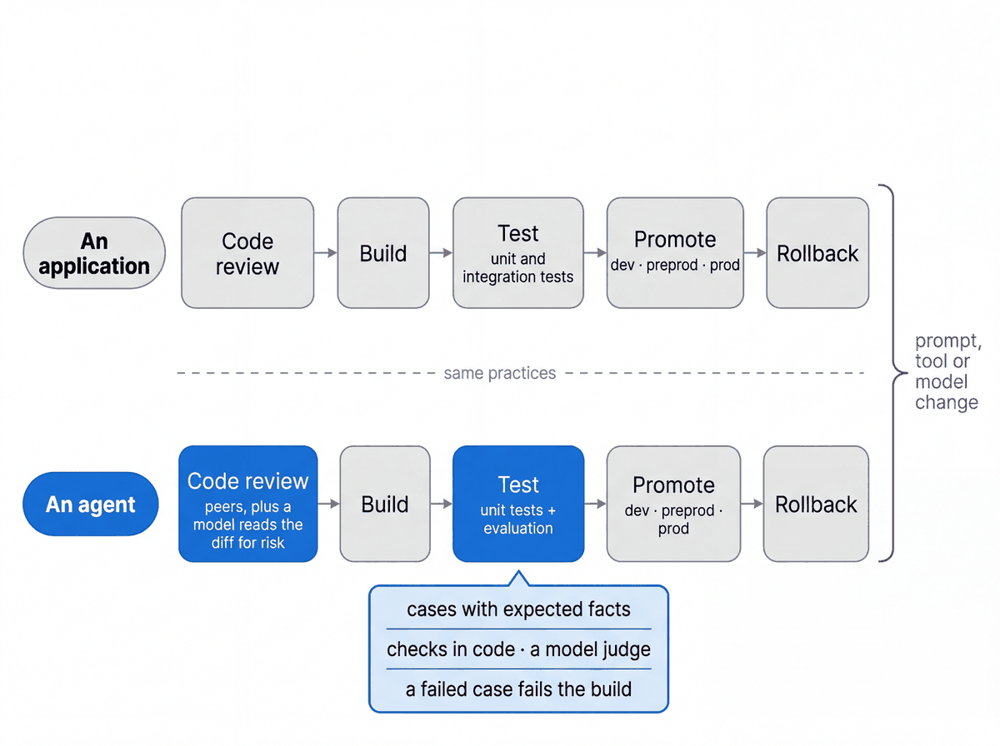

# Promotion strategy: dev → preprod → prod

These recommendations are platform-agnostic; the repo implements them for Agent Runtime (formerly Agent Engine)
with Cloud Build approval triggers as the orchestrator and GitHub Actions for pull-request checks.

## Principles

1. **One commit, a manifest per rung.** `deployment/release.py` exports the requirements from the resolved lock
   and writes `release.json`: the git SHA, the SHA-256 digest of that exported requirements file, the prompt and
   config digests, the model ids and the pinned secret versions. Each environment's build writes its own
   `release.json` for the selected commit and deploys the `agents/` package from it, the way the Agent Runtime
   docs show (`extra_packages` + `requirements`); the approver compares that commit and its digests with the
   earlier rung's evidence, because the scripts do not chain the rungs themselves. Preprod and prod refuse a dirty or
   mismatched checkout (`deploy.py --env prod --release release.json`).
2. **Only configuration differs per environment.** `agents/cymbal_store_ops/config/envs/<env>.yaml` holds the
   runtime service account, model pins, dataset names, `min_instances`, the traffic mode and the
   secret references. Nothing else may differ.
3. **Secrets are references, never values.** Agent Runtime resolves Secret Manager references at start
   (`env_vars={"KEY": {"secret": "...", "version": "3"}}`). Versions are pinned so a rollback restores exactly
   what the old revision saw; `latest` is refused by the release script.
4. **Evaluations are the gates.** The pull-request gate runs the golden set against the local agent
   (`tests/eval`). The preprod gate runs the golden prompts against the deployed revision
   (`deployment/remote_eval.py`). Review the preceding stage’s evidence before approving the next build; the deploy build then evaluates its new revision.
5. **Prod changes are traffic edits.** A prod deploy creates a new revision that receives 0 % of traffic.
   `traffic.py promote --revision <candidate> --percent 10` starts a canary; `--percent 100` completes it;
   `rollback --to <previous>` shifts 100 % back. Every traffic change names its revision; rollback never rebuilds anything.
6. **Identities are separate.** A read-only evaluator identity runs gates; one deployer identity per
   environment deploys; the runtime identity is the engine's own service account. Pipelines are keyless
   (Workload Identity Federation). See `docs/IAM_MATRIX.md`.
7. **Project per environment in real life.** The sandbox runs three engines in one project to keep the workshop
   cheap; the config already carries `project_id`, so moving to a project per environment is a config change.

## What changes per environment

| | dev | preprod | prod |
|---|---|---|---|
| Engine / dataset / runtime SA | own | own | own |
| Model and thinking | same evaluated configuration | same evaluated configuration | same evaluated configuration |
| Secrets (same names) | test values | test values | real values, pinned versions |
| `min_instances` | 1 | 0 | 1 |
| Traffic | always latest | always latest | manual split (canary) |
| Approvals | none | 1 | 3 (canary revision, 10 %, 100 %); rollback is gated too |
| Eval gate | PR, local agent | deployed revision | deployed revision + smoke + direct revision probe |
| Who deploys | developer (`uv run python deployment/release.py && uv run python deployment/deploy.py --env dev --release release.json`) | pipeline | pipeline |

## The ladder, step by step

1. Pull request → `ci.yml` (lint, unit, eval gate as the evaluator identity).
2. Merge → `release.py` → `deploy.py --env dev --release release.json` → `smoke.py --env dev`.
3. Approval → `deploy.py --env preprod --release release.json` → `smoke.py` → `remote_eval.py --env preprod`.
4. Approval → `deploy.py --env prod --release release.json` (new revision at 0 %) → `smoke.py --revision <new>` →
   `traffic.py promote --env prod --percent 10`.
5. Observe (traces, error rate, the golden prompts against the revision) → approval →
   `traffic.py promote --percent 100`, or `traffic.py rollback --to <previous revision>`.
6. Periodically `traffic.py prune --env prod` to delete zero-traffic revisions (the newest three are kept).

## Concurrency and staleness

One promotion at a time per engine is a rule the operator keeps by hand: this repository configures no shared
lock, Cloud Build runs concurrent builds of the same trigger, and the scripts cannot enforce it. A production
pipeline needs an explicit lock shared by every promotion and rollback entry point. What they do enforce: preprod and
prod deploys refuse a checkout whose commit, prompts or config differ from `release.json`, and every traffic
change names the exact revision it acts on (`promote --revision`, `rollback --to`), so no pipeline stage depends
on a record written by another. Engine ids reach the pipelines as variables (`AGENT_ENGINE_ID`), never through
the repository.

## Where each orchestrator fits

| Orchestrator | In this repo | Gate mechanism |
|---|---|---|
| Cloud Build | `cloudbuild/*.yaml`, `deployment/iam/setup_cloudbuild_triggers.sh` | `--require-approval` triggers, `gcloud alpha builds approve` |
| GitHub Actions | `.github/workflows/ci.yml` (checks); `deploy.yml` reference | Environments with required reviewers need GitHub Enterprise on private repos |

Any other CI system fits the same shape: the job's OIDC token is exchanged through Workload Identity
Federation for a short-lived Google credential (no keys), and the job runs the same `deployment/*.py` steps.
Approval gates stay in Cloud Build, where they are IAM-governed (`roles/cloudbuild.approver`) and audited.

**If your source and pipelines live in Bitbucket.** Nothing in this repository changes. Turn on OIDC for the
pipeline step (Bitbucket issues a per-step identity token), create a Workload Identity Federation provider whose
issuer is your workspace's OIDC endpoint (shown on the repository's OpenID Connect settings page) with a
condition that pins your repository, and bind the read-only evaluator service account to it for pull-request
checks. The step then installs `uv`, runs `ruff`, the unit tests and `pytest tests/eval` exactly as `ci.yml`
does. For promotion, let the merge to `main` trigger the Cloud Build ladder (Cloud Build connects to Bitbucket
Cloud and Bitbucket Server as source repositories), so the approvals, the per-environment deployer identities
and the audit trail stay in Google Cloud rather than depending on a paid deployment-gate feature in the CI tool.
