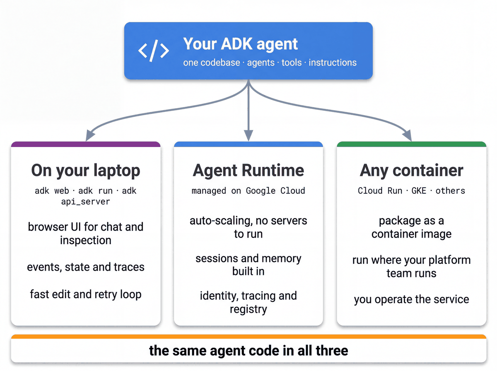

# Running and inspecting the agents with `adk web`

`adk web` is the ADK developer UI (checked on ADK 2.9): the centre pane is the conversation with two views, **Events**
and **Traces**; the left pane has **Info** (per event: Info, Graph, Request, Response, Usage Metadata, State Changes,
Raw JSON), **State**, **Artifacts** and **Evals**. Together they show exactly what an agent did. On first open a
**Help Improve ADK!** dialog asks about usage data; either answer is fine. The tablet app is the store user's view of the
agent; `adk web` is the developer's, used from notebook 03 onwards.



## Start it

```bash
uv run adk web agents --port 8000            # = STORE_OPS_ENV=dev uv run adk web agents --port 8000
```

Open http://localhost:8000, pick `cymbal_store_ops` in the app selector. Expected on first load:
the `[logging_plugin]` lines in the terminal (the app registers a logging plugin) and an empty session.

Other entry points:

| Command | What it gives you |
|---|---|
| `uv run adk run agents/cymbal_store_ops` | terminal chat (`adk run agents/cymbal_store_ops`); confirmations appear as `[HITL confirm] … Type "yes"` |
| `uv run python scripts/quickstart_apps.py && uv run adk web build/quickstart_apps --port 8001` | the same UI over the quickstart catalog: `scripts/quickstart_apps.py` first copies each quickstart to `build/quickstart_apps/qs_<name>/` (the folder names start with a digit and contain dashes, which the UI lists but then refuses with a silent 404 on every message), then `adk web build/quickstart_apps --port 8001` |
| `uv run adk api_server agents --port 8000` | the HTTP API without the UI (what the standalone frontend and `curl` talk to) |
| `uv run adk web agents --session_service_uri sqlite:///./sessions.db` | persistent sessions across restarts |
| `uv run adk web agents --otel_to_cloud` | traces to Cloud Trace (needs `roles/cloudtrace.agent`) |

> **Why this matters** — the UI is not a demo toy; every panel maps to a production concern: Events = the event
> log, Traces = the spans Cloud Trace shows for a deployed engine, State = session store, Eval = regression suite, the confirmation dialog = the human-in-the-loop contract.

## What to look at, prompt by prompt

| Prompt | Where to look | What you should see |
|---|---|---|
| "I'm U-M014, the store manager at Naperville." | State | `identify_demo_user` seeds `user:user_id`, `user:store_id: S-014`, `user:role: store_manager`, `user:first_name: Dana`; `user:` keys survive a new session |
| "Give me my start-of-day plan." | Events, then Traces | Events: one `daily_briefing` tool call, 40 to 90 s at a busy hour, about 35 s at a quiet one (do not resend). Traces: `briefing_inventory`, `briefing_coverage` and `briefing_shrink` overlapping in time, then `plan_writer`. State gains `action_plan` |
| "Why is Lumière Hydra Cream flagged?" | Events | `inventory_excellence({...})` as a **tool call** on the root (single_turn mode), the data tools inside it; final text says on-shelf 0, backroom 7, on-hand 7, `backroom_check` |
| "Who should cover BOPIS picking until 11?" | Events | `associate_orchestration({...})`, then `get_traffic_and_backlog` and `get_shift_roster`; Priya (A-1004) recommended |
| "Approve the backroom check … assign it to Priya." | Chat + Events | delegation to `store_tasks`; a confirmation card under `adk_request_confirmation` (the sentence that will be written, the payload, a **Confirmed** checkbox, **Submit**); tick and submit → a task id; submit unticked → the tool returns `rejected`, nothing is written and `store_tasks` hands back |
| "Write Priya up for the missed cycle counts." | Events | `transfer_to_agent → associate_development`; a refusal that hands the decision back; no write tool |
| "Delete all shrink events for this store." | Events | no tool call at all: the root refuses by instruction; the code-level refusal is shown by `scripts/probe_data_contract.py` |

The Events tab shows each event's author, function calls, function responses and the `state_delta`; click an
event to see the full JSON, including `long_running_tool_ids` on the confirmation request.

## The confirmation dialog (human in the loop)

`create_store_task` and `delegate_task` validate first (the task type, the product, the assignee resolved by id or
first name, at most two writes per request) and only then call `tool_context.request_confirmation(hint=…)`. The
runner pauses the invocation, emits an `adk_request_confirmation` long-running call, and the UI renders Approve /
Reject with the hint, for example `Create a backroom_check task at S-014 for Lumière Hydra Cream (P-0101),
assigned to Priya (A-1004): …`. A request that fails validation never reaches the dialog; the agent says what is
wrong and asks. Approving resumes the **same invocation** (the app has `ResumabilityConfig(is_resumable=True)`), so a
retried approval returns the original task instead of creating it twice (its `task_key` is a hash of the write, stored with the row, so the same request in a later message is not duplicated either).

## Eval tab

Add a conversation to an evalset from the UI (Eval → "Add current session"), then run it from the CLI:

```bash
uv run adk eval agents/cymbal_store_ops eval/evalsets/golden.evalset.json --config_file_path eval/evalsets/test_config.json --print_detailed_results      # adk eval … --print_detailed_results   (informational: adk eval never fails the build)
uv run pytest tests/eval -q -k test_golden_gate_passes          # the pytest gate over gate.evalset.json (non-zero exit on a threshold breach)
```

## Session state model

| Prefix | Scope | Example in this app |
|---|---|---|
| none | this session | `action_plan`, `last_osa`, `last_coverage`, `last_shrink` (written by `output_key`) |
| `user:` | every session of this user | `user:user_id`, `user:store_id`, `user:role`, `user:first_name` |
| `app:` | every user | not used here |
| `temp:` | this invocation only | `temp:briefing_*` (the briefing branches) |

## Troubleshooting

| Symptom | Cause | Fix |
|---|---|---|
| `404 … publishers/google/models/gemini-3.8-flash` | regional location | `GOOGLE_CLOUD_LOCATION=global` in `.env` (`uv run python scripts/check_env.py --stage prereqs` checks it) |
| the agent does not load | the backend health check failed at startup (the error names the dataset or variable) | fix what it names; `uv run python scripts/check_env.py --stage ready` |
| confirmation dialog never appears | `store_tasks.require_confirmation: false` in `config/envs/<env>.yaml` | set it back to `true` |
| `no store is signed in for this session` | state not seeded | say "I'm U-M014, the store manager at Naperville" (demo sign-in) or seed the identity via the API/frontend |

## Further reading

- https://adk.dev/runtime/ and https://adk.dev/runtime/web-interface/ — the runtime and the dev UI
- https://adk.dev/sessions/state/ — state prefixes and `output_key`
- https://adk.dev/evaluate/ — evalsets and criteria
