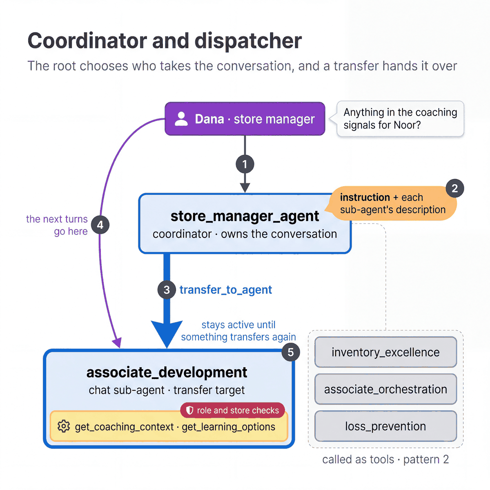

# Coordinator and dispatcher

[All patterns](README.md) · [Next: Agent as a tool](02-agent-as-a-tool.md)

**ADK docs:** [Coordinator and dispatcher](https://adk.dev/workflows/patterns/#coordinator-and-dispatcher) · [Agent modes and transfers](https://adk.dev/workflows/collaboration/#mode-configuration-and-behaviors)

**What it is.** One agent owns the conversation and decides which sub-agent takes the next turn. A transfer hands the
conversation to that sub-agent.

**Agentic flow**

1. The manager asks about an associate's development.
2. `store_manager_agent` reads its instruction and the `description` of each sub-agent.
3. It calls `transfer_to_agent` for `associate_development`.
4. The following turns go to `associate_development`, which has the full conversation history.
5. `associate_development` stays active until it transfers back to the root.

**A good fit when**

- A topic needs several turns with its own instructions and tools, such as a coaching conversation.
- The route depends on what the person means, so a model has to judge it.
- The specialist needs the full conversation history to do its job.

**Design alternatives**

- [Agent as a tool](02-agent-as-a-tool.md) when the specialist should answer once and return control.
- A [workflow graph](08-workflow-graph.md) when the route is a business rule that code can decide.

**Considerations**

- The model routes on the sub-agent descriptions. Overlapping descriptions cause misroutes.
- A transfer changes which agent the person is talking to. The role and store checks still run on every tool call.
- Each added sub-agent is one more option the root has to choose between.

**In our build**

| | |
|---|---|
| Agent | `store_manager_agent` transfers to `associate_development`. The other three specialists are called as tools. |
| Source | [`agent.py`](../../agents/cymbal_store_ops/agent.py), [`sub_agents/associate_development.py`](../../agents/cymbal_store_ops/sub_agents/associate_development.py) |
| Try it | In the tablet app, open **Associate development** and ask "Anything in the coaching signals for Noor?". Agent activity shows the transfer. |
| Pattern script | [`01_coordinator_vs_single_turn.py`](../../quickstarts/10-multi-agent-router/patterns/01_coordinator_vs_single_turn.py) |
