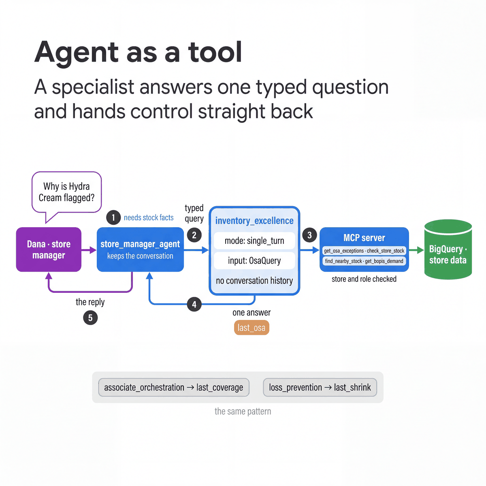

# Agent as a tool

[All patterns](README.md) · [Previous: Coordinator and dispatcher](01-coordinator-and-dispatcher.md) · [Next: Sequential pipeline](03-sequential-pipeline.md)

**ADK docs:** [Single-turn mode](https://adk.dev/workflows/collaboration/#mode-configuration-and-behaviors) · [Agent-as-a-Tool](https://adk.dev/tools-custom/function-tools/#agent-tool)

**What it is.** A specialist agent that the coordinator calls like a function. It takes one typed question, returns one
answer and does not take over the conversation.

**Agentic flow**

1. The root decides it needs an inventory analysis.
2. It calls `inventory_excellence` with an `OsaQuery`.
3. The specialist runs its own tools against the store data.
4. It returns one answer and writes it to the `last_osa` state key.
5. The root writes the reply. The person has been talking to the root throughout.

**A good fit when**

- A focused analysis is needed inside a wider conversation, such as why a product is flagged.
- Many conversations need the same expertise, and none should be handed over to it.
- The specialist can work from a structured question and does not need the chat history.

**Design alternatives**

- A [coordinator](01-coordinator-and-dispatcher.md) transfer when the specialist should own the next few turns.
- A plain function tool when the answer is a lookup with no judgement in it.

**Considerations**

- A consultation is several model calls: the specialist calls tools and answers, then the root writes the reply.
- `include_contents="none"` withholds the conversation from the specialist. Session state is still shared.
- The root also has direct read tools, so the model chooses between a lookup and a consultation.
- These specialists are sub-agents with `mode="single_turn"`. ADK generates the delegation tool for each one. `AgentTool` is the
  other way to call an agent as a tool; see [Hierarchical task decomposition](06-hierarchical-task-decomposition.md).

**In our build**

| | |
|---|---|
| Agents | `inventory_excellence`, `associate_orchestration`, `loss_prevention`: `mode="single_turn"`, each with an input schema and an `output_key` |
| Source | [`sub_agents/inventory_excellence.py`](../../agents/cymbal_store_ops/sub_agents/inventory_excellence.py), [`associate_orchestration.py`](../../agents/cymbal_store_ops/sub_agents/associate_orchestration.py), [`loss_prevention.py`](../../agents/cymbal_store_ops/sub_agents/loss_prevention.py) |
| Try it | In the tablet app, open **Shelf availability** and ask "Give me the two worst on-shelf problems right now." Agent activity shows whether the root consulted the specialist or read the stock directly. |
| Pattern script | [`01_coordinator_vs_single_turn.py`](../../quickstarts/10-multi-agent-router/patterns/01_coordinator_vs_single_turn.py) |
