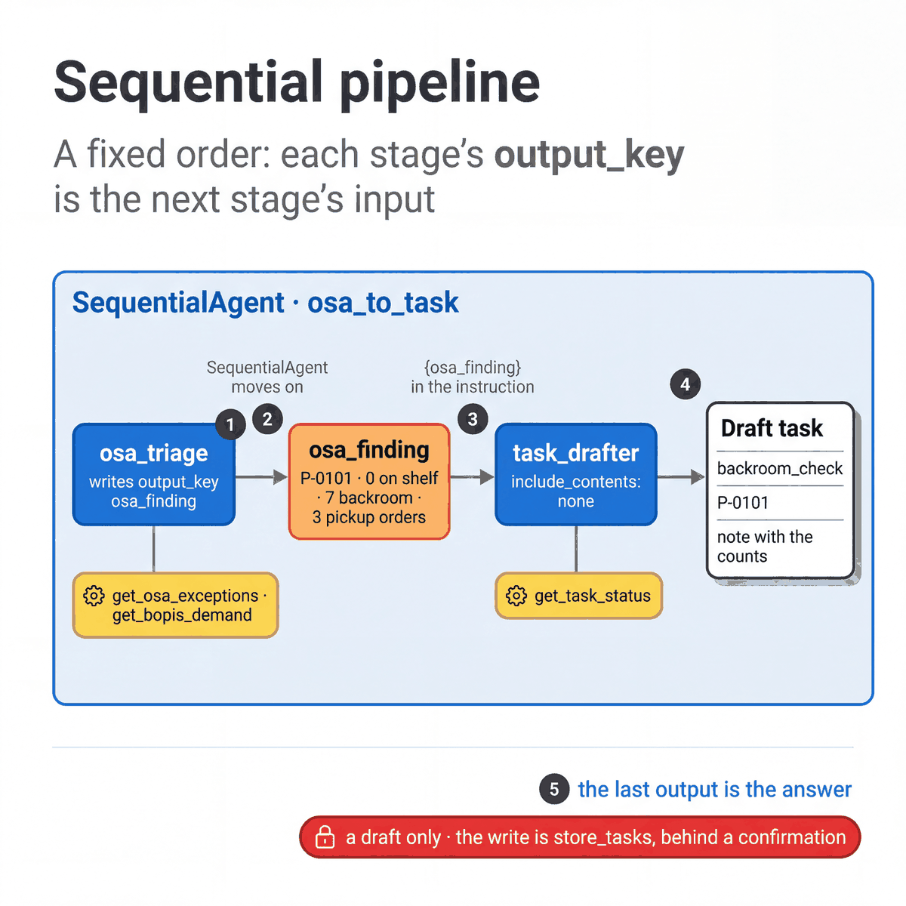

# Sequential pipeline

[All patterns](README.md) · [Previous: Agent as a tool](02-agent-as-a-tool.md) · [Next: Parallel fan-out and gather](04-parallel-fan-out.md)

**ADK docs:** [Sequential pipeline](https://adk.dev/workflows/patterns/#sequential-pipeline) · [SequentialAgent](https://adk.dev/agents/workflow-agents/sequential-agents/)

**What it is.** Agents run in a fixed order. Each agent writes its result to a state key, and the next agent reads that key.

**Agentic flow**

1. `osa_triage` reads the shelf gaps and pickup demand, and writes `osa_finding`.
2. `SequentialAgent` starts the next agent.
3. `task_drafter` receives `{osa_finding}` in its instruction. It does not see the triage conversation.
4. It checks for an open task on that product and drafts one if there is none.
5. The draft is the pipeline's answer.

**A good fit when**

- The steps always happen, and always in the same order.
- Each step needs the previous step's result, such as a finding that becomes a task.
- Each step is easier to prompt and test on its own than as part of one large prompt.

**Design alternatives**

- A [coordinator](01-coordinator-and-dispatcher.md) when some steps are not always needed.
- One agent with several tools when the order does not matter.

**Considerations**

- The state keys are the contract between stages. A renamed key breaks the next stage's instruction.
- Every stage adds a model call, on every run.
- The drafter creates nothing. In the store agent, writes go through `store_tasks` and a confirmation.

**In our build**

| | |
|---|---|
| Agents | `osa_to_task`: `osa_triage`, then `task_drafter` |
| Source | [`02_sequential_osa_to_task.py`](../../quickstarts/10-multi-agent-router/patterns/02_sequential_osa_to_task.py) |
| Try it | `uv run python quickstarts/10-multi-agent-router/patterns/02_sequential_osa_to_task.py` |
| In the store agent | `daily_briefing` is also a `SequentialAgent`: the parallel reads, then `plan_writer`. See [parallel fan-out](04-parallel-fan-out.md). |
