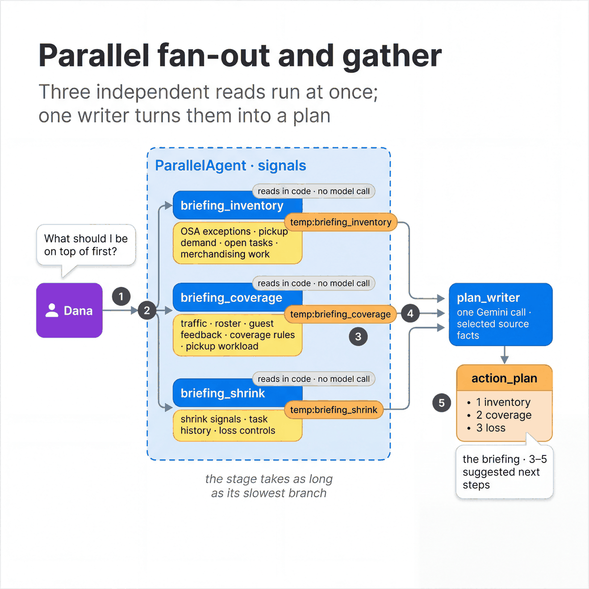

# Parallel fan-out and gather

[All patterns](README.md) · [Previous: Sequential pipeline](03-sequential-pipeline.md) · [Next: Iterative refinement](05-iterative-refinement.md)

**ADK docs:** [Parallel fan-out and gather](https://adk.dev/workflows/patterns/#parallel-fan-out-and-gather) · [ParallelAgent](https://adk.dev/agents/workflow-agents/parallel-agents/) · [Custom agents](https://adk.dev/agents/custom-agents/)

**What it is.** Several independent steps run at the same time. One writer then combines their results into a
single answer.

**Agentic flow**

1. The manager asks for the start-of-day priorities.
2. `ParallelAgent` starts three branches together: inventory, coverage and loss.
3. Each branch reads its sources and writes one state key: `temp:briefing_inventory`, `temp:briefing_coverage`,
   `temp:briefing_shrink`.
4. `plan_writer` reads the three keys and makes one Gemini call.
5. The plan is saved as `action_plan` and returned as the briefing, with three to five suggested next steps.

**A good fit when**

- The answer needs several sources that do not depend on each other, such as stock, staffing and loss.
- Reading them one after another would be too slow.
- One step at the end can combine the results.

**Design alternatives**

- A [sequential pipeline](03-sequential-pipeline.md) when one step needs another step's result.
- One agent with several tools when the work is small and the model should choose what to read.

**Considerations**

- The parallel stage takes as long as its slowest branch.
- In the store agent each branch is a custom agent (`BaseAgent`) that reads in code and makes no model call. The only
  model call is the writer's. The ADK docs example uses an `LlmAgent` per branch, as the pattern script does.
- Decide what a failed branch means before it happens: a partial plan, or no plan.

**In our build**

| | |
|---|---|
| Agent | `daily_briefing`: `signals` (`ParallelAgent`, three branches), then `plan_writer` |
| Source | [`sub_agents/daily_briefing.py`](../../agents/cymbal_store_ops/sub_agents/daily_briefing.py), [`sub_agents/briefing_signals.py`](../../agents/cymbal_store_ops/sub_agents/briefing_signals.py) |
| Try it | In the tablet app, ask "What should I be on top of first?", then open **Agent activity → View trace**. |
| Pattern script | [`03_parallel_fanout_gather.py`](../../quickstarts/10-multi-agent-router/patterns/03_parallel_fanout_gather.py) gives each branch its own model call, for comparison. |
