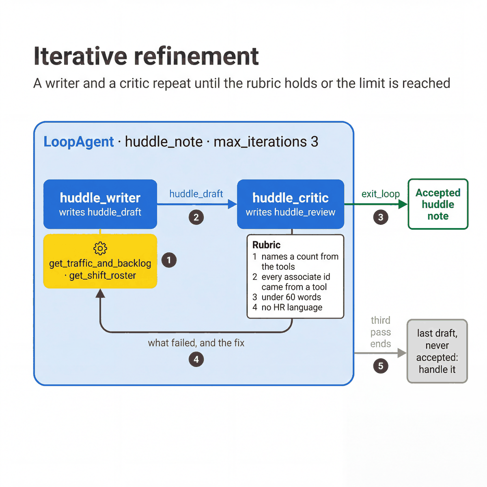

# Iterative refinement

[All patterns](README.md) · [Previous: Parallel fan-out and gather](04-parallel-fan-out.md) · [Next: Hierarchical task decomposition](06-hierarchical-task-decomposition.md)

**ADK docs:** [Iterative refinement](https://adk.dev/workflows/patterns/#iterative-refinement) · [Generate and review](https://adk.dev/workflows/patterns/#generate-and-review-pattern) · [LoopAgent](https://adk.dev/agents/workflow-agents/loop-agents/)

**What it is.** A writer and a critic take turns inside a `LoopAgent`. The loop ends when the critic accepts the
draft or the iteration limit is reached. A single write-then-review pass with no loop is the ADK generate and review
pattern.

**Agentic flow**

1. `huddle_writer` reads traffic, backlog and the roster, and writes `huddle_draft`.
2. `huddle_critic` checks the draft against a four-point rubric.
3. If every point holds, the critic calls `exit_loop`.
4. If not, it lists what failed and the writer rewrites the note.
5. After the third pass the loop stops, whether or not a draft was accepted.

**A good fit when**

- The output must meet explicit rules, such as quoting real counts and staying under a word limit.
- A first draft often misses one of the rules, and a second pass fixes it.
- The rules are hard to check in code. Where code can check them, use code.

**Design alternatives**

- One agent with a stronger prompt when its first draft is already good enough.
- A validator in code when the rubric can be checked without a model, as quickstart 07 does after its loop.

**Considerations**

- Cost is the number of passes times two model calls. Set `max_iterations`.
- The writer does not see the rubric. The critic is the only thing that enforces it.
- Handle the case where the loop ends without an accepted draft.

**In our build**

| | |
|---|---|
| Agents | `huddle_note` (`LoopAgent`, `max_iterations=3`): `huddle_writer`, `huddle_critic` |
| Source | [`04_loop_generate_review.py`](../../quickstarts/10-multi-agent-router/patterns/04_loop_generate_review.py) |
| Try it | `uv run python quickstarts/10-multi-agent-router/patterns/04_loop_generate_review.py` |
| See also | [Quickstart 07](../../quickstarts/07-document-extraction-agent/README.md): an extract-and-review loop, then a comparison in code. |
