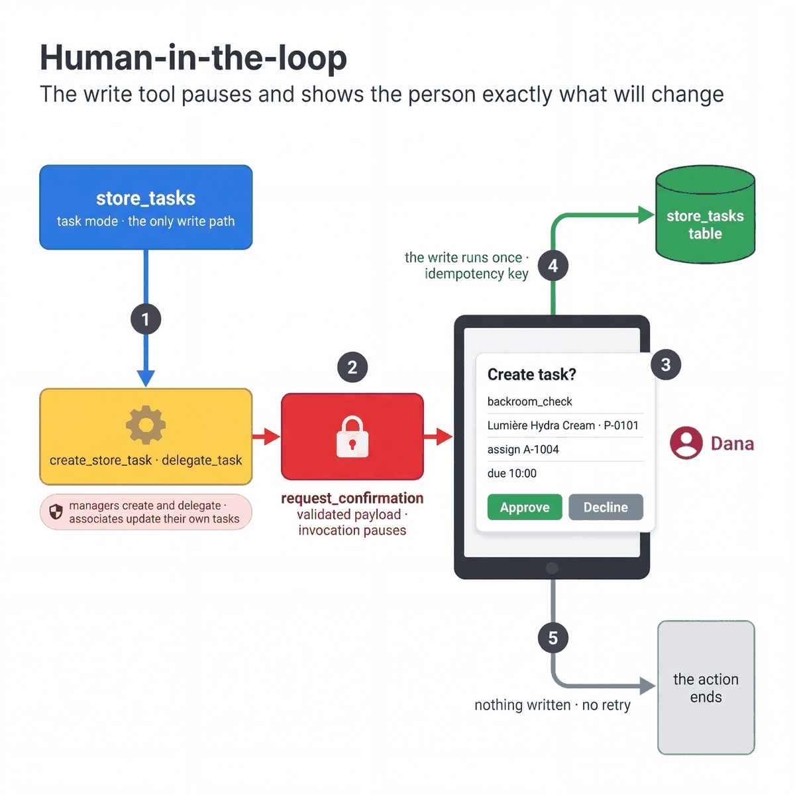

# Human-in-the-loop

[All patterns](README.md) · [Previous: Hierarchical task decomposition](06-hierarchical-task-decomposition.md) · [Next: Workflow graph](08-workflow-graph.md)

**ADK docs:** [Human-in-the-loop](https://adk.dev/workflows/patterns/#human-in-the-loop) · [Advanced tool confirmation](https://adk.dev/tools-custom/confirmation/#advanced-confirmation)

**What it is.** A tool that changes data pauses and asks a person to confirm, showing exactly what will be written.

**Agentic flow**

1. `store_tasks` calls `create_store_task` or `delegate_task`.
2. The tool validates its arguments and calls `request_confirmation`. The invocation pauses.
3. The person sees the task type, product, assignee and due time.
4. Approve: the invocation resumes and the row is written under an idempotency key.
5. Decline: nothing is written, and the agent does not retry in that turn.

**A good fit when**

- The action is costly to undo, such as a task assignment, a price change or a refund.
- A person is accountable for the decision.
- The volume is low enough for someone to review each one.

**Design alternatives**

- Review after the fact when the action is cheap to undo.
- No confirmation, with tight guardrails and an audit trail, when the volume rules out a person on every write.

**Considerations**

- The confirmation is in the tool's code. A prompt cannot skip it.
- The idempotency key is derived from the write itself, so a repeated approval finds the existing row.
- Managers create and delegate tasks. Associates complete or report a blocker on their own tasks only.

**In our build**

| | |
|---|---|
| Agent | `store_tasks` (`mode="task"`) is the write path for creating and delegating tasks |
| Source | [`tools/domain_tools.py`](../../agents/cymbal_store_ops/tools/domain_tools.py) (`_needs_confirmation`, `_task_key`), [`sub_agents/store_tasks.py`](../../agents/cymbal_store_ops/sub_agents/store_tasks.py), [`tools/personal_tools.py`](../../agents/cymbal_store_ops/tools/personal_tools.py) |
| Try it | In the tablet app, ask for the opening plan and choose a suggested task. Decline the confirmation and check that no task was created. Ask again and approve it. |
| See also | [Quickstart 03](../../quickstarts/03-form-completion-agent/README.md) uses `FunctionTool(require_confirmation=True)`. |
