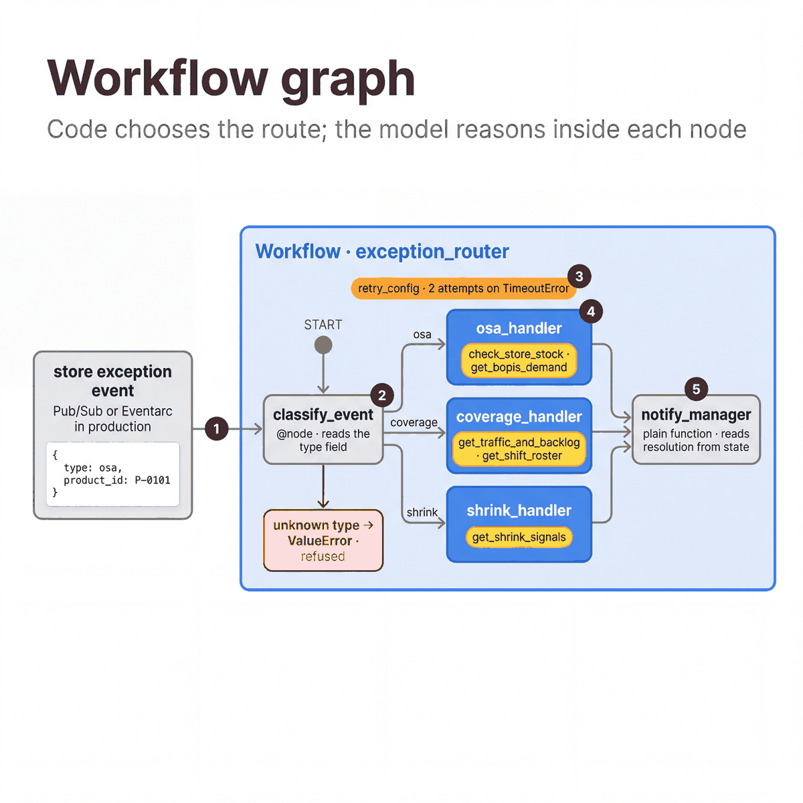

# Workflow graph

[All patterns](README.md) · [Previous: Human-in-the-loop](07-human-in-the-loop.md)

**ADK docs:** [Graph-based agent workflows](https://adk.dev/graphs/) · [Route branches and conditional execution](https://adk.dev/graphs/routes/#route-branches-and-conditional-execution)

**What it is.** A graph of nodes where code chooses the route. Model calls happen inside the nodes.

**Agentic flow**

1. A store exception event arrives with a `type` field.
2. `classify_event`, a plain function node, routes on that field.
3. If the feed times out, `retry_config` runs the node a second time.
4. One handler agent runs its tools and writes `resolution`.
5. `notify_manager`, another function node, formats the result. An unknown type raises `ValueError`.

**A good fit when**

- The route is a business rule, such as an event type or a reason code.
- The routing has to be tested and audited like any other code.
- Some steps need retries, and an unknown input should fail instead of being guessed.

**Design alternatives**

- A [coordinator](01-coordinator-and-dispatcher.md) when the route depends on what the person means.
- A plain function when there is no model call anywhere on the path.

**Considerations**

- The routing is code, so it can be unit tested.
- A retried node runs twice. Make it safe to repeat.
- An event with no route fails. It does not fall through to a default handler.

**In our build**

| | |
|---|---|
| Workflow | `exception_router`: `classify_event`, then `osa_handler`, `coverage_handler` or `shrink_handler`, then `notify_manager` |
| Source | [`05_workflow_graph.py`](../../quickstarts/10-multi-agent-router/patterns/05_workflow_graph.py) |
| Try it | `uv run python quickstarts/10-multi-agent-router/patterns/05_workflow_graph.py` |
| See also | [Quickstart 11](../../quickstarts/11-ambient-event-agent/README.md) takes an event as input and publishes a recommendation to Pub/Sub. |
