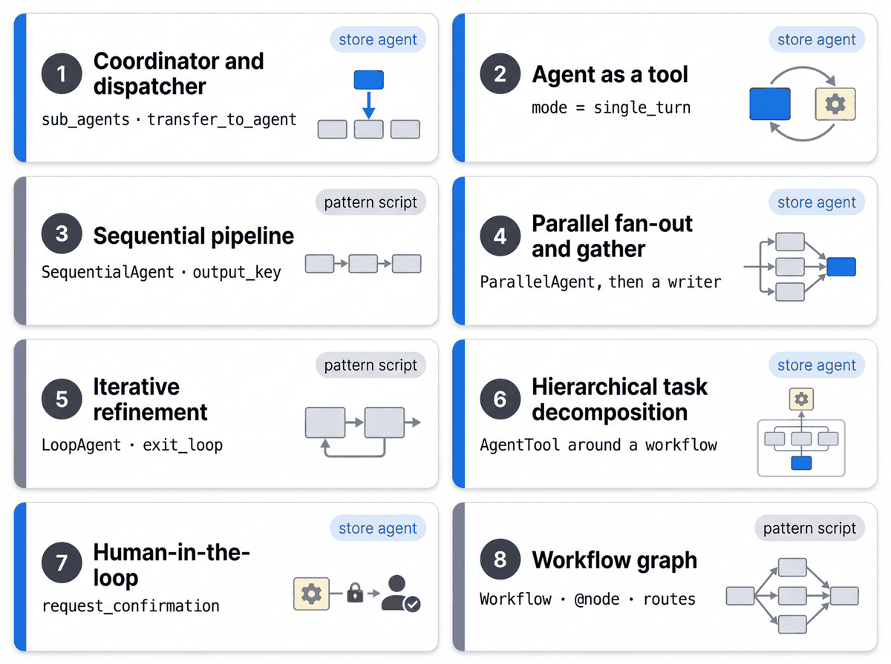

# ADK agent patterns

[Notebook 02](../../notebooks/02_agent_patterns.ipynb) · [Quickstarts](../../quickstarts/README.md) · [Architecture](../ARCHITECTURE.md)

Eight patterns, one page each. Every page has a diagram, the numbered flow shown in that diagram, the matching
section of the ADK docs, and the code in this repository that implements it.

| # | Pattern | ADK construct | In this repository |
|---|---|---|---|
| 1 | [Coordinator and dispatcher](01-coordinator-and-dispatcher.md) | `sub_agents`, `transfer_to_agent` | `store_manager_agent` transfers to `associate_development` |
| 2 | [Agent as a tool](02-agent-as-a-tool.md) | `mode="single_turn"` sub-agents | `inventory_excellence`, `associate_orchestration`, `loss_prevention` |
| 3 | [Sequential pipeline](03-sequential-pipeline.md) | `SequentialAgent`, `output_key` | `osa_triage`, then `task_drafter` (pattern script) |
| 4 | [Parallel fan-out and gather](04-parallel-fan-out.md) | `ParallelAgent`, then a writer | `daily_briefing`: three branches, then `plan_writer` |
| 5 | [Iterative refinement](05-iterative-refinement.md) | `LoopAgent`, `exit_loop` | `huddle_writer` and `huddle_critic` (pattern script) |
| 6 | [Hierarchical task decomposition](06-hierarchical-task-decomposition.md) | `AgentTool` around a workflow | `daily_briefing`, called by the root as one tool |
| 7 | [Human-in-the-loop](07-human-in-the-loop.md) | `request_confirmation` in the tool | `create_store_task`, `delegate_task` |
| 8 | [Workflow graph](08-workflow-graph.md) | `Workflow`, `@node`, routes | `exception_router` (pattern script) |

Patterns 1, 2, 4, 6 and 7 run in the store agent and the tablet app. Patterns 3, 5 and 8 are standalone scripts in
[`quickstarts/10-multi-agent-router/patterns/`](../../quickstarts/10-multi-agent-router/patterns/); `uv run python quickstarts/10-multi-agent-router/patterns/01_coordinator_vs_single_turn.py`
runs all five scripts.

The twelve [quickstarts](../../quickstarts/README.md) cover other ADK capabilities one at a time: function tools,
retrieval, confirmation, OpenAPI tools, BigQuery tools, memory, artifacts, MCP, callbacks, events and A2A.
