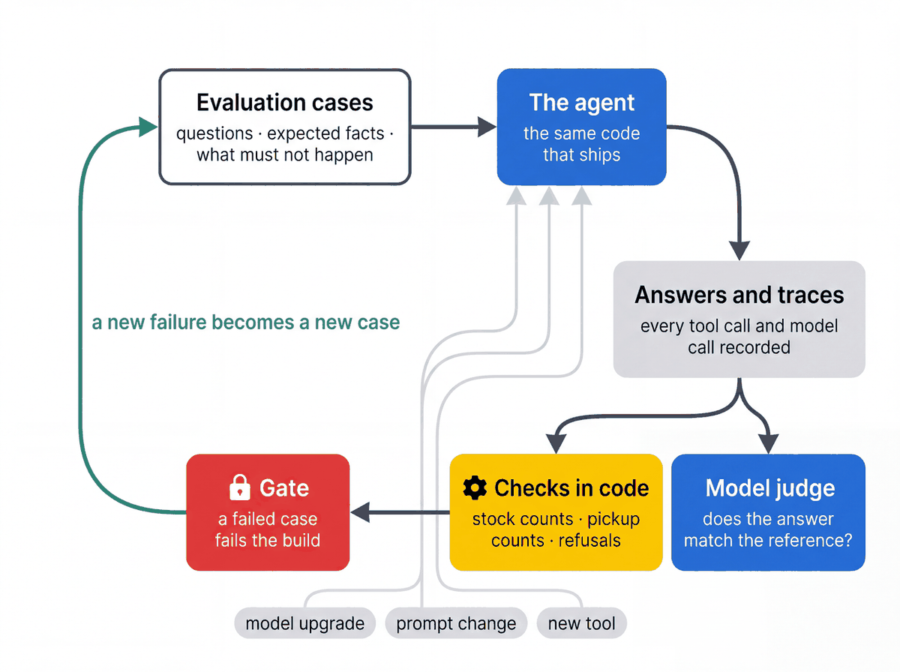

# Evaluate the agent

[Workshop home](../README.md) · [Notebook 04](../notebooks/04_evaluate_and_observe.ipynb) · [Test suites](../tests/README.md)

A working function does not guarantee a useful answer. Evaluation checks whether the agent uses available
evidence, answers the current question, preserves constraints and respects access boundaries.



## Choose the check

| Check | What it answers | Source / command |
|---|---|---|
| Golden gate | Does this candidate satisfy the required quality thresholds? | [evalsets](evalsets/) · `uv run pytest tests/eval -q -k test_golden_gate_passes` |
| Broad questions | Does it answer varied, unscripted requests across store domains? | [broad_scenarios.py](broad_scenarios.py), [run_broad.py](run_broad.py) |
| Multi-turn conversations | Does it retain context when the user changes or refines a request? | [Conversation tests](../journeys/README.md) |
| Suggested actions | Are follow-up activities supported by the current evidence? | [run_suggested_actions.py](run_suggested_actions.py) |
| Grounding review | Are claims supported by the saved tool evidence? | [review_grounding.py](review_grounding.py) |
| Model comparison | What changes in quality, calls and latency with a model configuration? | [compare_models.py](compare_models.py) |
| Plan writer thinking level | Does a lower thinking level make the opening briefing faster without losing grounding? | [benchmark_writer.py](benchmark_writer.py): the same opening question, N runs per level, judged against the signal reports the writer received |

## Run the gate

With your cloud project, namespace, credentials and dev dataset configured:

```bash
uv run python eval/build_eval_set.py
uv run pytest tests/eval -q -k test_golden_gate_passes
```

The pytest wrapper in [test_golden.py](../tests/eval/test_golden.py) makes threshold failures fail the build.
It checks fixture preconditions before scoring. Review any fixture mismatch before explicitly resetting data;
resetting removes workshop task changes. The gate is a live model evaluation, not an offline unit test.

## Read the results

[metrics.py](metrics.py) contains factual checks such as order-versus-unit counts and stock consistency.
The ADK evaluation configuration combines those checks with model-based criteria. Golden runs record
invocations under `build/eval_runs/`; other runners print their output paths. Inspect failed answers together
with their tool results. A judge score is evidence for review, not proof of operational correctness.

Tests should constrain supported facts and forbidden effects. Require a particular tool only when testing
that tool's contract or a safety boundary; open-ended questions can have more than one valid tool path.

Use `--help` on the individual runners to select cases, output directories and concurrency. A full breadth
run and judge review make cloud calls and are separate from `uv run pytest tests/unit tests/quickstarts -q`.

### Coverage recommendations

The coverage check derives eligible associates from matched, successful roster and workforce records,
including skills, shift bounds, assigned tasks, breaks and protected coverage. It does not require a
particular name or trust the tool's preferred candidate. A generic roster path also needs complete
assignment evidence. The final answer must name an evidenced candidate for the requested window and
state the pending-order count; explicit order/unit pairs are checked against recorded workload.
The semantic judge assesses whether the proposed primary and relief schedule uses those facts correctly.
For the golden fixture, Jordan can cover the full window; Priya is also a valid primary when her
10:30–10:45 break is covered. Fixture counts and all scoring thresholds remain unchanged.
