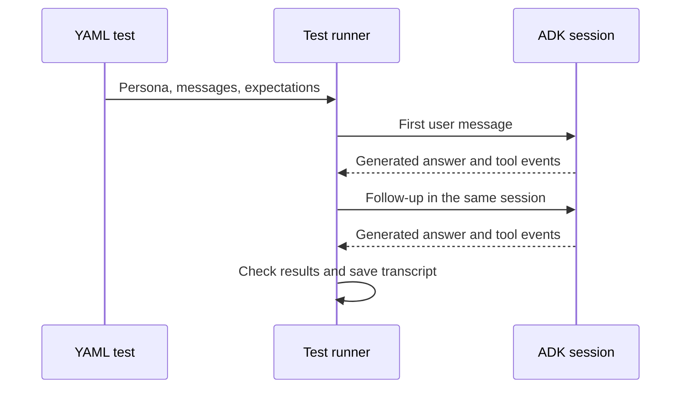

# Multi-turn conversation tests

[Evaluation guide](../eval/README.md) · [Notebook 04](../notebooks/04_evaluate_and_observe.ipynb)

A journey is a scripted conversation with the agent: several user messages sent one after another in one real
agent session, with checks on each turn. It is part of the agent's evaluation. The evaluation gate in
[eval/](../eval/README.md) scores single questions; a journey tests what only shows up across turns, such as
whether a follow-up keeps the constraints the person gave earlier. For example: ask for stock, narrow it to
skincare, then ask for a cheaper alternative, and check that the last answer is still about skincare.

Each YAML file holds one journey: the persona who is signed in, the messages to send, and what to check after
each one (tools called, facts in the answer, refusals, latency). The file holds no answers. The model writes every
response and chooses its own tools, and [run.py](run.py) checks what happened. "Journey" is this repository's
name. ADK evaluation sets can also hold multi-turn conversations; `run.py` adds a check on every turn (tools,
facts, refusals, latency) and writes a readable transcript of each run.



## What is in this folder?

| Files | Purpose |
|---|---|
| `personas.yaml` | Test identities seeded into trusted session state |
| `01-` through `15-` YAML | Focused continuity, permissions and operational regression cases |
| `80-` and `81-` YAML | Broader capability coverage and follow-up cases |
| [run.py](run.py) | Load cases, create sessions, invoke the agent and grade recorded results |

The tablet's starter scenarios are defined separately in [frontend/scenarios.yaml](../frontend/scenarios.yaml).
The [ADK evaluation sets](../eval/evalsets/) and this custom runner are complementary: ADK supplies the
standard evaluation machinery; this runner adds explicit multi-turn checks and readable transcripts.

## Inspect or run a conversation

```bash
uv run python journeys/run.py --list
uv run python journeys/run.py --journey manager-start-of-shift
uv run python journeys/run.py --target remote --env dev --journey ops-inventory-1
```

Listing cases is local. Running them calls the model and configured data services. A case with `writes: true`
can change task data, and `approve: true` supplies confirmation in the test. Review the selected YAML first.
Results go to `build/journeys/`. Exit code 1 means an expectation failed; 2 means execution failed.

## Add a case

Start with a meaningful user goal and expected facts. Give the runner a persona and a sequence of `say`
messages; do not embed tool instructions in ordinary user questions. Every turn needs an expectation.
Use latency bounds to identify regressions without confusing a timing failure with a factual error.

### Expectations

| key | meaning |
| --- | --- |
| `tools_all` | every named tool ran in this turn |
| `tools_any` | at least one of them ran |
| `tools_none` | none of them ran |
| `contains_all` / `contains_any` | case-insensitive substrings of the **final answer** |
| `not_contains` | substring appears in **no text** the turn produced |
| `regex_all` | each regex matches the final answer (case-insensitive, dotall) |
| `regex_none` | no regex matches **any text** the turn produced |
| `refusal` | `true`: the answer declines. `false`: it does not |
| `no_tool_errors` | no tool returned `status: ERROR` |
| `tool_error_regex` | some tool error matches this — for the deliberate scope refusals |
| `confirmation` | `required` or `forbidden`: whether a confirmation dialog was raised |
| `max_latency_s` | the turn finished within this many seconds |
| `state_has` | session state after the turn, key by key |

Positive checks read the final answer; negative checks (`not_contains`, `regex_none`) read every text
the turn produced, including a sub-agent's, so a leak cannot hide in an intermediate message. A turn
with no expectations is rejected by the schema — it would grade nothing.

`refusal` is matched against a fixed phrase list (`REFUSAL_RE` in `run.py`): "can't", "cannot",
"don't have", "not covered", "blocked by policy", "sign in", "stays with the manager", and similar.
Hypothetical `if …` clauses are stripped before matching, because without that "if associates cannot
pick from the backroom immediately", buried in a store comparison, read as a refusal. It is a coarse
signal on purpose; pair it with `regex_none` when what matters is that a specific invented fact did
*not* appear.

### Confirmations

The two write tools ask for confirmation before anything is written. A turn with `approve: true`
answers yes; every other turn answers no. The runner resumes the same invocation with a
`adk_request_confirmation` function response, the same round-trip the frontend does.
