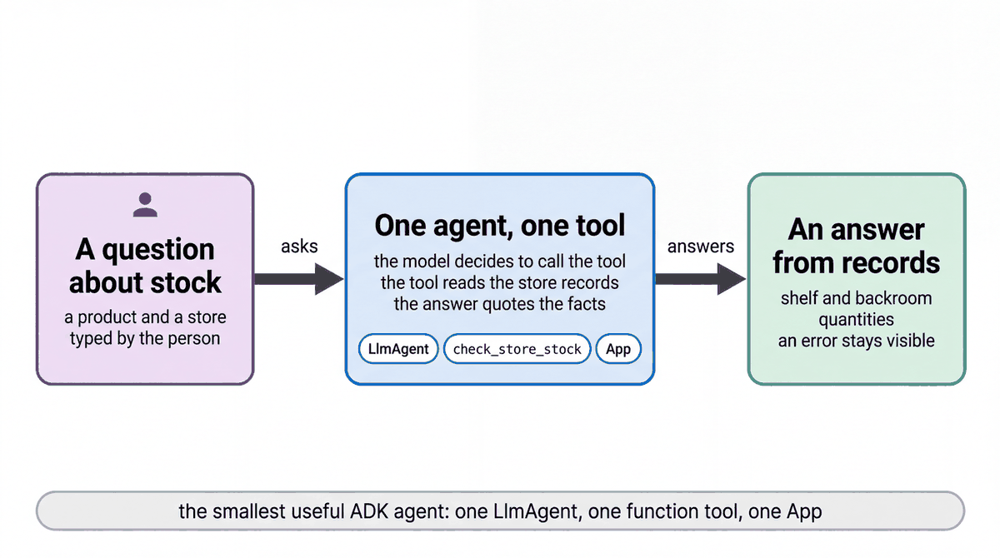

# Build an agent with one function tool

| | |
|-|-|
| Author(s) | [Matt Robinson](https://github.com/mr394729) |

## Overview

This quickstart builds the smallest useful agent in the [Agent Development Kit](https://google.github.io/adk-docs/) (ADK): one agent and one function tool. The tool is `check_store_stock`, the same tool the Cymbal Beauty store agent uses, so the agent answers from the store inventory in BigQuery: what is on the shelf, what is in the backroom, and whether a guest can pick the product up in store.

In this quickstart, you learn:

- How ADK turns a Python function into a tool the model can call
- How to define an agent with an instruction and one tool
- How to run the agent with a `Runner` and read the tool call in its events

## Architecture



An `LlmAgent` has a name, a model, an instruction and a list of tools. A [function tool](https://google.github.io/adk-docs/tools/function-tools/) is a Python function: ADK reads its name, parameters and docstring and describes it to the model. When the model calls the tool, ADK runs the function and sends the result back. The `App` wraps the agent so that `adk web`, `adk eval` and Agent Runtime load the same object.

## What the agent does

Ask whether a product is in stock in a city, for example *Is Lumière Hydra Cream in stock in Naperville?* The agent calls `check_store_stock` once and answers with the store, the units on the shelf and in the backroom, and whether pick-up is available. It never guesses a quantity: if the tool fails, it says what could not be checked.

### Files

| File | Contents |
|-|-|
| [walkthrough.ipynb](walkthrough.ipynb) | Step-by-step notebook: call the tool, define the agent, run it |
| [agent.py](agent.py) | The agent, for the developer UI and the evaluation |
| [eval/](eval/) | Evaluation set and criteria |
| [tests/](tests/) | Unit tests |

## Prerequisites

- The workshop setup in [SETUP.md](../../SETUP.md): a Google Cloud project, `gcloud` signed in with Application Default Credentials, `uv sync` run in the repository root, and a `.env` file with `GOOGLE_CLOUD_PROJECT` and `WORKSHOP_NAMESPACE`.
- The store data loaded into your namespace ([notebook 01](../../notebooks/01_store_data.ipynb)).

## Run the agent

### In the notebook

Open [walkthrough.ipynb](walkthrough.ipynb) in Jupyter, VS Code or Colab Enterprise and run the cells in order.

### In the ADK developer UI

`agent.py` defines the agent. The developer UI needs Python package names, so copy the quickstart into `build/quickstart_apps` under a name it accepts, then start the UI. Run these commands from the repository root:

```bash
uv run python scripts/quickstart_apps.py 01-hello-tool-agent
uv run adk web build/quickstart_apps --port 8001
```

Open http://localhost:8001 and choose `qs_01_hello_tool_agent`.

## Test the agent

The unit tests check the tools and the agent's configuration without calling the model:

```bash
uv run pytest quickstarts/01-hello-tool-agent/tests --import-mode=importlib
```

The evaluation set in `eval/` runs the agent against reference conversations with the ADK evaluator:

```bash
uv run python scripts/eval_quickstarts.py --only 01
```

## Clean up

This quickstart creates no cloud resources.

## Learn more

- [ADK function tools](https://google.github.io/adk-docs/tools/function-tools/)
- [ADK agents](https://google.github.io/adk-docs/agents/)
