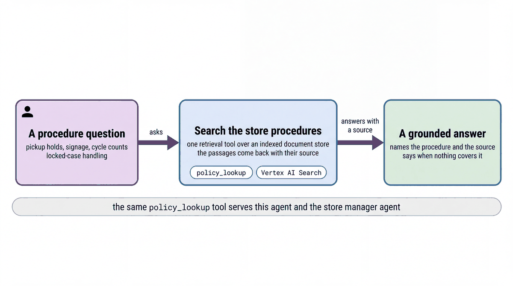

# Answer questions from store procedures with Vertex AI Search

| | |
|-|-|
| Author(s) | [Matt Robinson](https://github.com/mr394729) |

## Overview

This quickstart grounds an agent's answers in Cymbal Beauty's store operating procedures. The procedures are indexed in a [Vertex AI Search](https://cloud.google.com/generative-ai-app-builder/docs/introduction) data store. The agent searches it with `policy_lookup`, answers only from the passages it finds, and cites each source. The store agent uses the same tool.

In this quickstart, you learn:

- How to create a Vertex AI Search data store with layout-based chunking and import documents from Cloud Storage
- How to search the data store directly and read each result's source
- How to build an agent that answers only from retrieved passages and cites them

## Architecture



The seven procedures in [docs/](docs/) are Markdown. They are converted to HTML, uploaded to Cloud Storage and imported into a Vertex AI Search data store named `cymbal-store-sops-<namespace>`. The data store uses the layout parser with [layout-based chunking](https://cloud.google.com/generative-ai-app-builder/docs/parse-chunk-documents), so each procedure is split into passages along its headings. `policy_lookup` searches in `CHUNKS` mode and returns each passage with its title, source URI and a citation ID.

The procedures cover the locked fragrance case, damaged goods and shrink, planogram resets, promotion signage, cycle counts, pick-up order holds, and product comparisons. They are fictional training material.

## What the agent does

Ask a procedure question, for example *A guest's pick-up order has been ready for a week. Can we still hold it?* The agent calls `policy_lookup`, answers in at most three sentences from the passages it gets back, and cites the procedure title and citation ID; here SOP 06 sets a five-day hold. When no procedure covers the question, the agent says so and suggests asking the manager on duty.

### Files

| File | Contents |
|-|-|
| [walkthrough.ipynb](walkthrough.ipynb) | Step-by-step notebook: create the data store, search it, build and run the agent |
| [agent.py](agent.py) | The agent, for the developer UI and the evaluation; reads `SOP_DATA_STORE` |
| [sop_data_store.py](sop_data_store.py) | The same data store steps as a command: `setup`, `verify`, `teardown` |
| [docs/](docs/) | The seven store procedures |
| [eval/](eval/) | Evaluation set and criteria |
| [tests/](tests/) | Unit tests |

## Prerequisites

- The workshop setup in [SETUP.md](../../SETUP.md): a Google Cloud project, `gcloud` signed in with Application Default Credentials, `uv sync` run in the repository root, and a `.env` file with `GOOGLE_CLOUD_PROJECT` and `WORKSHOP_NAMESPACE`.
- The store data loaded into your namespace ([notebook 01](../../notebooks/01_store_data.ipynb)).
- The Discovery Engine API enabled (`gcloud services enable discoveryengine.googleapis.com`) and permission to create data stores (`roles/discoveryengine.admin`). The agent at runtime needs only `roles/discoveryengine.viewer`.

## Run the agent

### In the notebook

Open [walkthrough.ipynb](walkthrough.ipynb) and run the cells in order. The notebook creates the data store; the first import and indexing take about ten minutes.

### Create the data store from the command line

`sop_data_store.py` runs the same steps as the notebook: create the data store, upload and import the procedures, wait until every procedure is searchable, and write `SOP_DATA_STORE` into `.env`. From the repository root:

```bash
uv run python quickstarts/02-rag-knowledge-agent/sop_data_store.py setup
uv run python quickstarts/02-rag-knowledge-agent/sop_data_store.py verify
```

`verify` searches for every procedure and reports whether each one comes back with its citation. When `SOP_DATA_STORE` is set, the store agent registers `policy_lookup` too.

### In the ADK developer UI

`agent.py` defines the agent. The developer UI needs Python package names, so copy the quickstart into `build/quickstart_apps` under a name it accepts, then start the UI. Run these commands from the repository root:

```bash
uv run python scripts/quickstart_apps.py 02-rag-knowledge-agent
uv run adk web build/quickstart_apps --port 8001
```

Open http://localhost:8001 and choose `qs_02_rag_knowledge_agent`.

## Test the agent

The unit tests check the tools and the agent's configuration without calling the model:

```bash
uv run pytest quickstarts/02-rag-knowledge-agent/tests --import-mode=importlib
```

The evaluation set in `eval/` runs the agent against reference conversations with the ADK evaluator:

```bash
uv run python scripts/eval_quickstarts.py --only 02
```

## Clean up

Delete the data store and the uploaded pages, and clear `SOP_DATA_STORE` in `.env`:

```bash
uv run python quickstarts/02-rag-knowledge-agent/sop_data_store.py teardown
```

After a delete, Vertex AI Search keeps the data store name reserved for up to a couple of hours.

## Learn more

- [Vertex AI Search](https://cloud.google.com/generative-ai-app-builder/docs/introduction)
- [Parse and chunk documents](https://cloud.google.com/generative-ai-app-builder/docs/parse-chunk-documents)
- [ADK tools](https://google.github.io/adk-docs/tools/)
