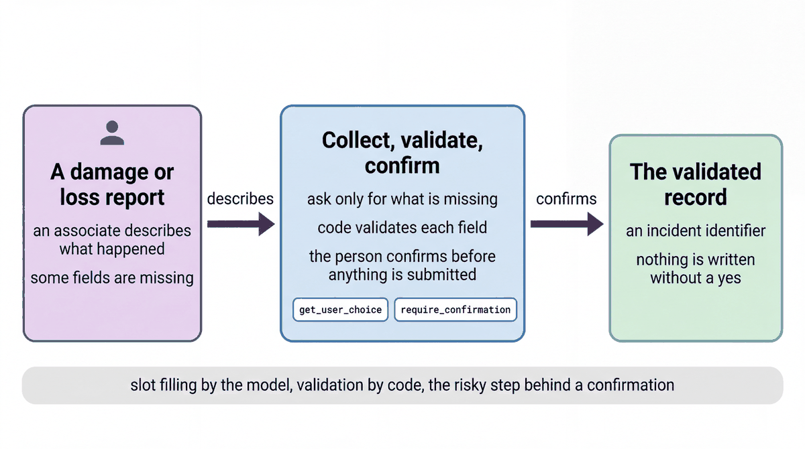

# Complete a form and confirm before submitting

| | |
|-|-|
| Author(s) | [Matt Robinson](https://github.com/mr394729) |

## Overview

This quickstart collects a form in conversation. A store associate reports damaged, missing or suspicious units for the shrink log. The agent uses what the associate already said, asks only for the missing fields, looks the product up in the catalog, and submits the report only after the associate approves it. The submit step checks every field in code and returns the record without writing it.

In this quickstart, you learn:

- How to collect a form in conversation without the model inventing values
- How to validate every field in the tool, not in the prompt
- How [tool confirmation](https://google.github.io/adk-docs/tools/confirmation/) pauses a turn, and how to approve it in code

## Architecture



The report has five fields: product, quantity, event type (`damage`, `unknown_loss` or `return_anomaly`), location in the store, and a short note. The agent's tools:

| Tool | What it does |
|-|-|
| `find_product` | Resolves the product the associate named to catalog IDs |
| `get_user_choice` | Offers the event type as buttons in the developer UI |
| `submit_incident_report` | Checks every field and returns the record. Registered with `FunctionTool(..., require_confirmation=True)`, so ADK asks the user to approve before it runs |
| `identify_demo_user` | Signs the session in as a demo associate, for the developer UI |

## What the agent does

Report an incident in your own words, for example *Log damage for Lumière Hydra Cream in the skincare aisle: the jars were crushed in a delivery tote.* The agent looks the product up, asks only for the missing quantity, then calls the submit tool. ADK pauses the turn for approval. After you approve, the agent gives an incident ID and says the report was not written. In the developer UI, start with *I'm A-1004* to sign in as an associate.

### Files

| File | Contents |
|-|-|
| [walkthrough.ipynb](walkthrough.ipynb) | Step-by-step notebook: define the tools, run the agent to the approval step, approve |
| [agent.py](agent.py) | The agent, for the developer UI and the evaluation |
| [eval/](eval/) | Evaluation set and criteria |
| [tests/](tests/) | Unit tests |

## Prerequisites

- The workshop setup in [SETUP.md](../../SETUP.md): a Google Cloud project, `gcloud` signed in with Application Default Credentials, `uv sync` run in the repository root, and a `.env` file with `GOOGLE_CLOUD_PROJECT` and `WORKSHOP_NAMESPACE`.
- The store data loaded into your namespace ([notebook 01](../../notebooks/01_store_data.ipynb)).

## Run the agent

### In the notebook

Open [walkthrough.ipynb](walkthrough.ipynb) and run the cells in order.

### In the ADK developer UI

`agent.py` defines the agent. The developer UI needs Python package names, so copy the quickstart into `build/quickstart_apps` under a name it accepts, then start the UI. Run these commands from the repository root:

```bash
uv run python scripts/quickstart_apps.py 03-form-completion-agent
uv run adk web build/quickstart_apps --port 8001
```

Open http://localhost:8001 and choose `qs_03_form_completion_agent`.

## Test the agent

The unit tests check the tools and the agent's configuration without calling the model:

```bash
uv run pytest quickstarts/03-form-completion-agent/tests --import-mode=importlib
```

The evaluation set in `eval/` runs the agent against reference conversations with the ADK evaluator:

```bash
uv run python scripts/eval_quickstarts.py --only 03
```

## Clean up

This quickstart creates no cloud resources and writes no records.

## Learn more

- [Tool confirmation](https://google.github.io/adk-docs/tools/confirmation/)
- [Session state](https://google.github.io/adk-docs/sessions/state/)
