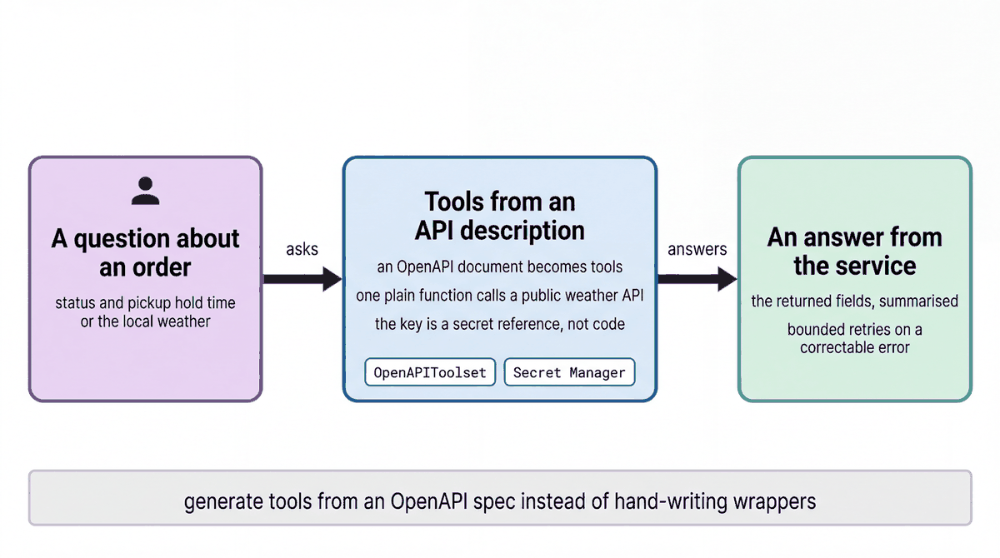

# Call external APIs from an agent

| | |
|-|-|
| Author(s) | [Matt Robinson](https://github.com/mr394729) |

## Overview

This quickstart connects an agent to two external APIs in the two most common ways. An order management API for buy-online-pick-up-in-store (BOPIS) orders is described by an OpenAPI document, and ADK's `OpenAPIToolset` turns each of its operations into a tool, with an API key. A public weather API is a plain function tool. A plugin lets the model correct a failed call and retry.

In this quickstart, you learn:

- How to generate agent tools from an OpenAPI document, with API-key authentication
- How to write a function tool over a public HTTP API
- How a plugin changes the agent's behavior on tool errors

## Architecture



The order management API is a small FastAPI mock in [`quickstarts/_services/orders_api`](../_services/orders_api/app.py), with the Naperville store's pick-up orders. Every request needs the `X-API-Key` header. [openapi.yaml](openapi.yaml) describes its two operations, `get_order` and `list_orders`. [`OpenAPIToolset`](https://google.github.io/adk-docs/tools-custom/openapi-tools/) generates one tool per operation and sends the key with each call. `get_weather` calls the keyless [Open-Meteo](https://open-meteo.com/) API. `ReflectAndRetryToolPlugin` gives a tool error back to the model so it can fix its arguments, up to two times.

## What the agent does

Ask about pick-up orders or the weather. *What's the status of pick-up order BO-000651?* calls `get_order`. *Which ready orders at S-014 are close to the end of their hold?* calls `list_orders` with `status=ready` and reports each order's `hold_until`. *What's the weather in Naperville?* calls `get_weather` and says in one sentence what it means for pick-up traffic.

### Files

| File | Contents |
|-|-|
| [walkthrough.ipynb](walkthrough.ipynb) | Step-by-step notebook: start the API, create the tools, run the agent |
| [agent.py](agent.py) | The agent, for the developer UI and the evaluation; reads `ORDERS_API_KEY` and `ORDERS_API_URL` |
| [openapi.yaml](openapi.yaml) | The order management API description |
| [eval/](eval/) | Evaluation set and criteria |
| [tests/](tests/) | Unit tests |

## Prerequisites

- The workshop setup in [SETUP.md](../../SETUP.md): a Google Cloud project, `gcloud` signed in with Application Default Credentials, `uv sync` run in the repository root, and a `.env` file with `GOOGLE_CLOUD_PROJECT` and `WORKSHOP_NAMESPACE`.
- The store data loaded into your namespace ([notebook 01](../../notebooks/01_store_data.ipynb)).

## Run the agent

### In the notebook

Open [walkthrough.ipynb](walkthrough.ipynb) and run the cells in order. The notebook starts the mock API itself and stops it at the end.

### In the ADK developer UI

`agent.py` defines the agent. The developer UI needs Python package names, so copy the quickstart into `build/quickstart_apps` under a name it accepts, then start the UI. Run these commands from the repository root:

```bash
uv run uvicorn quickstarts._services.orders_api.app:app --port 8010 &
echo "ORDERS_API_KEY=demo-key" >> .env
uv run python scripts/quickstart_apps.py 04-external-api-agent
uv run adk web build/quickstart_apps --port 8001
```

Open http://localhost:8001 and choose `qs_04_external_api_agent`.

On Agent Runtime, deliver `ORDERS_API_KEY` from Secret Manager (`secret_env_vars` in `agents/cymbal_store_ops/config/envs/<env>.yaml`), and point `ORDERS_API_URL` at the real endpoint.

## Test the agent

The unit tests check the tools and the agent's configuration without calling the model:

```bash
uv run pytest quickstarts/04-external-api-agent/tests --import-mode=importlib
```

The evaluation set in `eval/` runs the agent against reference conversations with the ADK evaluator:

```bash
uv run python scripts/eval_quickstarts.py --only 04
```

## Clean up

Stop the mock API (`kill %1` in the shell that started it). This quickstart creates no cloud resources.

## Learn more

- [OpenAPI tools](https://google.github.io/adk-docs/tools-custom/openapi-tools/)
- [ADK plugins](https://google.github.io/adk-docs/plugins/)
