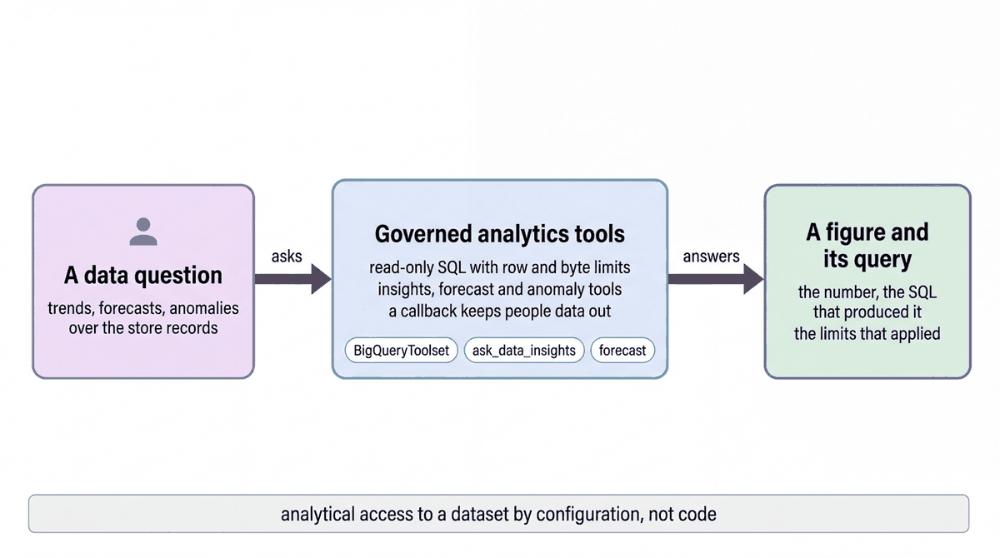

# Analyze store data with the BigQuery tools

| | |
|-|-|
| Author(s) | [Matt Robinson](https://github.com/mr394729) |

## Overview

This quickstart builds a data analyst agent over the Cymbal Beauty store dataset with ADK's [BigQuery toolset](https://adk.dev/integrations/bigquery/). The agent reads schemas, runs SQL, forecasts time series and looks for anomalies. It can only read: writes are blocked by configuration, and two callbacks keep it away from people data and from any dataset but yours.

In this quickstart, you learn:

- How to give an agent BigQuery tools with configuration rather than code
- How to make the tools read-only and traceable
- How `before_tool_callback` refuses a tool call before it runs

## Architecture



The agent gets six tools from `BigQueryToolset`: `list_table_ids`, `get_table_info`, `execute_sql`, `ask_data_insights` (Conversational Analytics), `forecast` and `detect_anomalies`. Access is controlled in three places:

| Control | What it does |
|-|-|
| `BigQueryToolConfig` | `WriteMode.BLOCKED`, a cap on result rows and bytes billed, and job labels on every query |
| `block_people_data` | A `before_tool_callback` that refuses any call that mentions the associates or coaching signals tables |
| Dataset fence | A `before_tool_callback` that allows only `SELECT` statements against your dataset, `cymbal_beauty_<namespace>_dev` |

## What the agent does

Ask an analytical question, for example *Which product category has the highest total shrink value across all stores?* The agent reads the schemas it needs, runs one `SELECT`, answers with the numbers, and ends with the SQL it ran. *Forecast daily visitors at store S-014 for the next 7 days* sums the hourly traffic into days and uses the `forecast` tool. A request for associate data, or for a change to the data, is refused.

### Files

| File | Contents |
|-|-|
| [walkthrough.ipynb](walkthrough.ipynb) | Step-by-step notebook: configure the toolset and the guards, run the agent |
| [agent.py](agent.py) | The agent, for the developer UI and the evaluation |
| [eval/](eval/) | Evaluation set and criteria |
| [tests/](tests/) | Unit tests |

## Prerequisites

- The workshop setup in [SETUP.md](../../SETUP.md): a Google Cloud project, `gcloud` signed in with Application Default Credentials, `uv sync` run in the repository root, and a `.env` file with `GOOGLE_CLOUD_PROJECT` and `WORKSHOP_NAMESPACE`.
- The store data loaded into your namespace ([notebook 01](../../notebooks/01_store_data.ipynb)).
- `roles/bigquery.dataViewer` on your dataset and `roles/bigquery.jobUser` in the project.

## Run the agent

### In the notebook

Open [walkthrough.ipynb](walkthrough.ipynb) and run the cells in order.

### In the ADK developer UI

`agent.py` defines the agent. The developer UI needs Python package names, so copy the quickstart into `build/quickstart_apps` under a name it accepts, then start the UI. Run these commands from the repository root:

```bash
uv run python scripts/quickstart_apps.py 05-data-analyst-agent
uv run adk web build/quickstart_apps --port 8001
```

Open http://localhost:8001 and choose `qs_05_data_analyst_agent`.

## Test the agent

The unit tests check the tools and the agent's configuration without calling the model:

```bash
uv run pytest quickstarts/05-data-analyst-agent/tests --import-mode=importlib
```

The evaluation set in `eval/` runs the agent against reference conversations with the ADK evaluator:

```bash
uv run python scripts/eval_quickstarts.py --only 05
```

## Clean up

This quickstart creates no cloud resources. Its queries carry the job label `adk_agent: data_analyst_agent`, so you can find them in `INFORMATION_SCHEMA.JOBS`.

## Learn more

- [BigQuery tools in ADK](https://adk.dev/integrations/bigquery/)
- [Callbacks](https://google.github.io/adk-docs/callbacks/)
- [BigQuery job labels](https://cloud.google.com/bigquery/docs/labels-intro)
