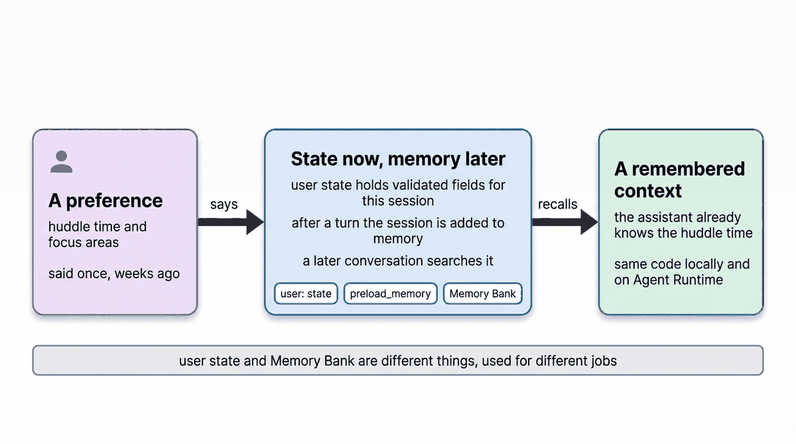

# Remember a store manager's preferences with state and Memory Bank

| | |
|-|-|
| Author(s) | [Matt Robinson](https://github.com/mr394729) |

## Overview

This quickstart builds an assistant that prepares a store manager's start-of-day huddle and remembers how the manager likes it. Settings with a known shape, the huddle time and the order of topics, are kept as `user:` session state. Facts that come up in conversation, such as who on the team is in training, go to [Vertex AI Memory Bank](https://cloud.google.com/vertex-ai/generative-ai/docs/agent-engine/memory-bank/overview), and the agent reads them back in later conversations.

In this quickstart, you learn:

- When to use `user:` state and when to use Memory Bank
- How to create an Agent Runtime (formerly Agent Engine) instance for Memory Bank
- How to send a conversation to Memory Bank, read the generated memories, and use them in a new session

## Architecture



| Part | What it does |
|-|-|
| `remember_preferences` | Writes `user:huddle_time` and `user:focus_areas`. Every new session for the user starts with them, and the instruction reads them with `{user:huddle_time?}` |
| `preload_memory` | Searches Memory Bank with the user's message before every turn and adds what it finds to the request |
| `load_memory` | Lets the model search memory on demand (in `agent.py`) |
| `after_agent_callback` | Sends the conversation to the memory service when a turn ends (in `agent.py`) |
| Store tools | `get_traffic_and_backlog`, `get_osa_exceptions` and `get_shrink_signals` read the huddle facts for the signed-in store |

Memory Bank is part of Vertex AI Agent Engine. Locally, `adk web` uses an in-memory memory service unless you point it at an Agent Engine instance. A deployed agent on Agent Runtime uses its own engine's Memory Bank.

## What the agent does

Tell the agent your huddle time and what to cover first, for example *My huddle is at 8:45 and I always want the BOPIS backlog first.* It saves both as user state and prepares the huddle from the store tools in that order. In a new session it already knows the time and the order, and it recalls facts from earlier conversations, such as who on the team is in training, from Memory Bank. In the developer UI, start with *I'm U-M014* to sign in as the store manager.

### Files

| File | Contents |
|-|-|
| [walkthrough.ipynb](walkthrough.ipynb) | Step-by-step notebook: create Memory Bank, hold two conversations, read the memories |
| [agent.py](agent.py) | The agent, for the developer UI and the evaluation |
| [eval/](eval/) | Evaluation set and criteria |
| [tests/](tests/) | Unit tests |

## Prerequisites

- The workshop setup in [SETUP.md](../../SETUP.md): a Google Cloud project, `gcloud` signed in with Application Default Credentials, `uv sync` run in the repository root, and a `.env` file with `GOOGLE_CLOUD_PROJECT` and `WORKSHOP_NAMESPACE`.
- The store data loaded into your namespace ([notebook 01](../../notebooks/01_store_data.ipynb)).
- Permission to create Vertex AI Agent Engine instances (`roles/aiplatform.user`).

## Run the agent

### In the notebook

Open [walkthrough.ipynb](walkthrough.ipynb) and run the cells in order. The notebook creates an Agent Engine instance for Memory Bank and deletes it at the end.

### In the ADK developer UI

`agent.py` defines the agent. The developer UI needs Python package names, so copy the quickstart into `build/quickstart_apps` under a name it accepts, then start the UI. Run these commands from the repository root:

```bash
uv run python scripts/quickstart_apps.py 06-memory-agent
uv run adk web build/quickstart_apps --port 8001
```

Open http://localhost:8001 and choose `qs_06_memory_agent`.

To use Memory Bank instead of the in-memory service, add `--memory_service_uri=agentengine://<agent engine id>` to the `adk web` command.

## Test the agent

The unit tests check the tools and the agent's configuration without calling the model:

```bash
uv run pytest quickstarts/06-memory-agent/tests --import-mode=importlib
```

The evaluation set in `eval/` runs the agent against reference conversations with the ADK evaluator:

```bash
uv run python scripts/eval_quickstarts.py --only 06
```

## Clean up

The notebook deletes the Agent Engine instance it created. If you created one some other way, delete it in the console or with `client.agent_engines.delete(name=..., force=True)`.

## Learn more

- [Session state](https://google.github.io/adk-docs/sessions/state/)
- [Memory in ADK](https://google.github.io/adk-docs/sessions/memory/)
- [Vertex AI Memory Bank](https://cloud.google.com/vertex-ai/generative-ai/docs/agent-engine/memory-bank/overview)
