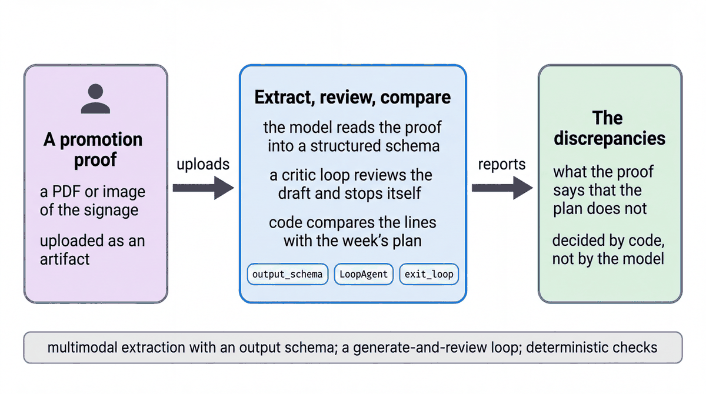

# Extract and check a promotion signage proof

| | |
|-|-|
| Author(s) | [Matt Robinson](https://github.com/mr394729) |

## Overview

Before a promotion goes live, each store receives a signage proof: the shelf signs with product, price and dates. This agent reads the proof (a PDF or an image), extracts every line into structured data, has a critic review the extraction, and then compares it with the week's promotion plan in plain Python. The model reads the document; code decides which differences are errors.

In this quickstart, you learn:

- How an agent extracts structured data from a PDF with `output_schema`
- How a `LoopAgent` pairs an extractor with a critic that ends the loop
- Why plain Python, not the model, decides which differences are errors

## Architecture



| Component | What it does |
|---|---|
| `SaveFilesAsArtifactsPlugin` | Stores a file attached to a message as a session artifact |
| `extractor` (`LlmAgent`) | Reads the proof, added to its request by the `attach_proof` callback, and returns a `PromoProof` (`output_schema`) |
| `critic` (`LlmAgent`) | Checks the draft against simple rules and calls `exit_loop` when they hold |
| `extract_and_review` (`LoopAgent`) | Runs the extractor and critic for at most two rounds |
| `compare_promo_proof` (tool) | Compares each extracted line with `promo_plan_2026W40.json` and returns every discrepancy |
| `checker` (`LlmAgent`) | Calls the comparison once and writes the report |

## What the agent does

1. The plugin saves the uploaded proof as an artifact.
2. The extractor copies what is printed on each line: product id, name, sign type, price and dates. It is told never to correct a value.
3. The critic checks the draft's form: product ids, positive prices, valid dates, line numbers without gaps.
4. The comparison finds price mismatches, date mismatches, products that are not on promotion and planned products without a sign.
5. The checker reports exactly what the comparison returned.

The sample proof, `eval/artifacts/promo_proof_S-014_2026W40.pdf`, has three planted errors. `uv run python quickstarts/_scripts/make_promo_proof.py` regenerates it.

## Prerequisites

- The [workshop setup](../../SETUP.md): a Google Cloud project with Vertex AI enabled, Application Default Credentials, and `GOOGLE_CLOUD_PROJECT` and `WORKSHOP_NAMESPACE` in `.env`.
- This agent uses Gemini only; it reads no store data.

## Run the agent

### In the notebook

Open [walkthrough.ipynb](walkthrough.ipynb) in Jupyter, VS Code or Colab Enterprise and run the cells in order.

### In the ADK developer UI

From the repository root, copy the quickstart into a folder that the ADK developer UI can load (it needs Python package names such as `qs_07_document_extraction_agent`), then start the UI:

```bash
uv run python scripts/quickstart_apps.py 07-document-extraction-agent
uv run adk web build/quickstart_apps --port 8001
```

Open http://localhost:8001, choose `qs_07_document_extraction_agent`, attach `quickstarts/07-document-extraction-agent/eval/artifacts/promo_proof_S-014_2026W40.pdf` with the paperclip, and send:

```text
Check the promotion signage proof I attached against this week's plan.
```

The report names three discrepancies: P-0101 printed at $24.99 (plan $22.99), P-0141 ending 2026-10-17 (plan 2026-10-10), and P-0333, which is not on promotion.

## Test the agent

The unit tests check the tools and the agent's configuration without calling the model:

```bash
uv run pytest quickstarts/07-document-extraction-agent/tests --import-mode=importlib
```

The evaluation set in `eval/` runs the agent against reference conversations with the ADK evaluator Besides the tool trajectory and a text match, it checks with `discrepancy_invariant` (in `metrics.py`) that the comparison returned exactly the three expected discrepancies:

```bash
uv run python scripts/eval_quickstarts.py --only 07
```

## Clean up

The agent creates no cloud resources. Stop the developer UI with Ctrl+C.

## Learn more

- [Loop agents](https://adk.dev/agents/workflow-agents/loop-agents/)
- [Sequential agents](https://adk.dev/agents/workflow-agents/sequential-agents/)
- [Plugins](https://adk.dev/plugins/)
