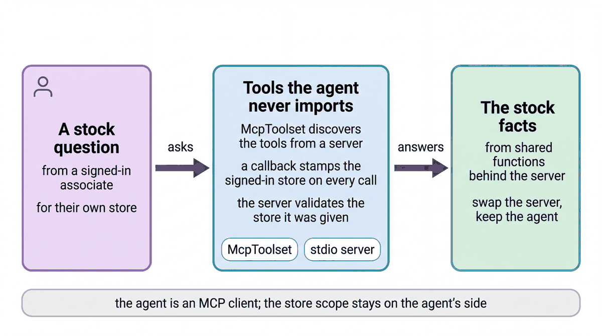

# Connect an agent to store tools over MCP

| | |
|-|-|
| Author(s) | [Matt Robinson](https://github.com/mr394729) |

## Overview

This agent gets its store tools from an MCP server instead of importing them. `McpToolset` starts the bundled server, `cymbal_mcp_server.py`, as a local process, lists its tools and gives them to the model. Because an MCP server has no session, the agent checks the store scope and adds the signed-in store to each call before the request leaves the agent.

In this quickstart, you learn:

- How `McpToolset` starts an MCP server and gives its tools to an agent
- How a `before_tool_callback` checks the store scope and adds the signed-in store to each call
- How the same pattern connects the deployed store agent to its MCP server on Cloud Run

## Architecture



| Component | What it does |
|---|---|
| `cymbal_mcp_server.py` | A `FastMCP` server with two read-only tools, `get_osa_exceptions` and `check_store_stock`, that call the shared store functions |
| `McpToolset` | Starts the server over stdio, lists its tools and calls them for the agent |
| `enforce_store_scope_before_tool` | Refuses a call for a store the signed-in person may not see |
| `stamp_signed_in_store` | Adds the session's store as `store_id` to each MCP call |
| `mcp_tools_agent` (`LlmAgent`) | Answers stock questions for the signed-in store |

The deployed store agent's production path is this same pattern: it reads every store record through the store MCP service on Cloud Run (`services/store_mcp/server.py`, 30 tools), using `McpToolset` with `StreamableHTTPConnectionParams` and an identity token in each request. See [`agents/cymbal_store_ops/mcp_catalog.py`](../../agents/cymbal_store_ops/mcp_catalog.py), [`agents/cymbal_store_ops/mcp_connection.py`](../../agents/cymbal_store_ops/mcp_connection.py) and the [store MCP service](../../docs/patterns/mcp-service.md).

## What the agent does

1. The first time the agent needs its tools, `McpToolset` starts the server and discovers `get_osa_exceptions` and `check_store_stock`.
2. The model picks a tool and leaves `store_id` empty.
3. The scope check runs, then the stamp adds the signed-in store, and the call goes to the server.
4. A request for another store is refused before anything reaches the server, unless the caller is a district manager.

## Prerequisites

- The [workshop setup](../../SETUP.md): a Google Cloud project, Application Default Credentials, and `GOOGLE_CLOUD_PROJECT` and `WORKSHOP_NAMESPACE` in `.env`.
- The store data loaded in your namespace (notebook `01_store_data.ipynb`).

## Run the agent

### In the notebook

Open [walkthrough.ipynb](walkthrough.ipynb) in Jupyter, VS Code or Colab Enterprise and run the cells in order.

### In the ADK developer UI

From the repository root, copy the quickstart into a folder that the ADK developer UI can load, then start the UI:

```bash
uv run python scripts/quickstart_apps.py 08-mcp-tools-agent
uv run adk web build/quickstart_apps --port 8001
```

Open http://localhost:8001 and choose `qs_08_mcp_tools_agent`. Sign in with `I'm U-M014` (Dana, manager of store S-014), then try:

```text
What are my top three on-shelf availability exceptions right now?
How much Lumière Hydra Cream do we have, and why is it flagged?
Show me the exceptions for store S-020.
```

The last request is refused because Dana manages S-014. To run the same agent from a terminal and see each MCP call:

```bash
uv run python quickstarts/08-mcp-tools-agent/mcp_client_agent.py
```

## Test the agent

The unit tests check the tools and the agent's configuration without calling the model:

```bash
uv run pytest quickstarts/08-mcp-tools-agent/tests --import-mode=importlib
```

The evaluation set in `eval/` runs the agent against reference conversations with the ADK evaluator:

```bash
uv run python scripts/eval_quickstarts.py --only 08
```

## Clean up

The server runs as a child process and stops with the agent. Stop the developer UI with Ctrl+C.

## Learn more

- [Model Context Protocol in ADK](https://adk.dev/mcp/)
- [Callbacks](https://adk.dev/callbacks/)
- [Register MCP servers in Agent Registry](https://docs.cloud.google.com/agent-registry/register-mcp-servers)
