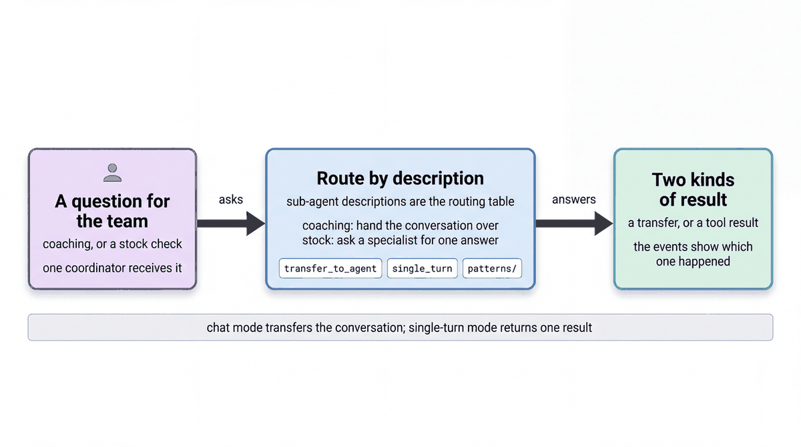

# Route between specialist agents

| | |
|-|-|
| Author(s) | [Matt Robinson](https://github.com/mr394729) |

## Overview

A coordinator agent with two sub-agents, one for each way a sub-agent can join in. The coordinator routes by the sub-agents' descriptions, with no routing rules in its instruction. The `patterns/` folder adds one short script for each workflow pattern, all on the store data.

In this quickstart, you learn:

- How a coordinator routes by its sub-agents' descriptions
- The difference between a `chat` sub-agent, which takes over, and a `single_turn` sub-agent, called like a tool
- How sequential, parallel, loop and graph workflows run on the same store data

## Architecture



| Component | Mode | What it does |
|---|---|---|
| `multi_agent_router` (`LlmAgent`) | Coordinator | Reads the question and picks a sub-agent from their descriptions |
| `coaching_specialist` (`LlmAgent`) | Chat | Takes over the conversation for coaching questions |
| `stock_lookup` (`LlmAgent`) | `single_turn` | Is called like a tool with a `product_name` and a `city`, answers once and hands back |

## What the agent does

A stock question fits `stock_lookup`. The coordinator calls it with only the inputs in its `input_schema` and writes the reply itself. A coaching question fits `coaching_specialist`, so the coordinator transfers the conversation and the specialist answers from then on.

The scripts in `patterns/` show the other shapes:

| Script | Pattern |
|---|---|
| `01_coordinator_vs_single_turn.py` | A chat transfer and a single-turn call |
| `02_sequential_osa_to_task.py` | `SequentialAgent` passing a finding to a task drafter through `output_key` |
| `03_parallel_fanout_gather.py` | `ParallelAgent` reading three signals at once, then one writer |
| `04_loop_generate_review.py` | `LoopAgent`: a writer and a critic that calls `exit_loop` |
| `05_workflow_graph.py` | A `Workflow` graph that routes an event to one of three agents |

## Prerequisites

- The [workshop setup](../../SETUP.md): a Google Cloud project, Application Default Credentials, and `GOOGLE_CLOUD_PROJECT` and `WORKSHOP_NAMESPACE` in `.env`.
- The store data loaded in your namespace (notebook `01_store_data.ipynb`).

## Run the agent

### In the notebook

Open [walkthrough.ipynb](walkthrough.ipynb) in Jupyter, VS Code or Colab Enterprise and run the cells in order.

### In the ADK developer UI

From the repository root, copy the quickstart into a folder that the ADK developer UI can load, then start the UI:

```bash
uv run python scripts/quickstart_apps.py 10-multi-agent-router
uv run adk web build/quickstart_apps --port 8001
```

Open http://localhost:8001, choose `qs_10_multi_agent_router`, and try:

```text
How much Lumière Hydra Cream do the Naperville stores hold?
I'm U-M014. How is A-1007 doing on BOPIS picking?
```

Run a pattern script; each prints every transfer, tool call and state change:

```bash
uv run python quickstarts/10-multi-agent-router/patterns/03_parallel_fanout_gather.py
```

## Test the agent

The unit tests check the tools and the agent's configuration without calling the model:

```bash
uv run pytest quickstarts/10-multi-agent-router/tests --import-mode=importlib
```

The evaluation set in `eval/` runs the agent against reference conversations with the ADK evaluator:

```bash
uv run python scripts/eval_quickstarts.py --only 10
```

## Clean up

The agent creates no cloud resources. Stop the developer UI with Ctrl+C.

## Learn more

- [Collaborative workflows](https://adk.dev/workflows/collaboration/)
- [Workflow patterns](https://adk.dev/workflows/patterns/)
