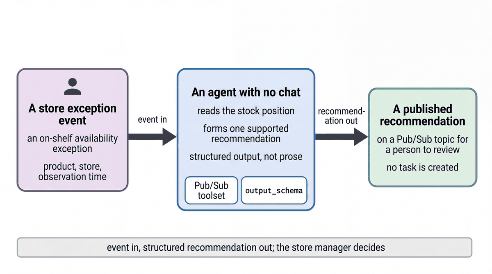

# React to a store event and publish a recommendation

| | |
|-|-|
| Author(s) | [Matt Robinson](https://github.com/mr394729) |

## Overview

An agent with no chat. Its input is a store exception event as JSON, here an on-shelf availability exception: a shelf scan found none of a product on the shelf. The agent reads the stock position at that store, drafts one recommendation with the counts as its reason, and publishes it to a Pub/Sub topic. It never creates a task; the store manager decides.

In this quickstart, you learn:

- How an agent runs from an event instead of a chat message
- How `PubSubToolset` lets an agent publish a message to a topic
- How to keep a person in charge: the agent recommends, the manager decides

## Architecture



| Component | What it does |
|---|---|
| `ambient_event_agent` (`LlmAgent`) | Handles `osa_exception` events and declines any other type |
| `check_store_stock` (tool) | Returns shelf, backroom and on-hand counts and a recommendation: `backroom_check`, `replenish`, `cycle_count` or `escalate` |
| `PubSubToolset` | Gives the agent one tool, `publish_message`, for the recommendations topic |
| Topic `cymbal-store-ops-recommendations-<namespace>` | Receives the recommendation; the name carries your namespace so people sharing a project never mix results |

## What the agent does

1. Reads the event's `store_id` and `product_name`. The event carries its own store, so no one needs to be signed in.
2. Calls `check_store_stock` for that product at that store.
3. Publishes a JSON recommendation with `store_id`, `product_id`, `action`, `rationale` and `detected_at`.
4. Replies in one sentence that the recommendation was published for the manager to approve.

## Prerequisites

- The [workshop setup](../../SETUP.md): a Google Cloud project, Application Default Credentials, and `GOOGLE_CLOUD_PROJECT` and `WORKSHOP_NAMESPACE` in `.env`.
- The store data loaded in your namespace (notebook `01_store_data.ipynb`).
- The Pub/Sub API enabled, and permission to create topics and subscriptions (`roles/pubsub.editor`).

## Run the agent

### In the notebook

Open [walkthrough.ipynb](walkthrough.ipynb) in Jupyter, VS Code or Colab Enterprise and run the cells in order.

### In the ADK developer UI

Create the topic the agent publishes to, and a pull subscription to read it back. The name carries your namespace:

```bash
export TOPIC_NAME=cymbal-store-ops-recommendations-$WORKSHOP_NAMESPACE
gcloud pubsub topics create $TOPIC_NAME --project $GOOGLE_CLOUD_PROJECT
gcloud pubsub subscriptions create $TOPIC_NAME-pull --topic $TOPIC_NAME --project $GOOGLE_CLOUD_PROJECT
export RECOMMENDATIONS_TOPIC=projects/$GOOGLE_CLOUD_PROJECT/topics/$TOPIC_NAME
```

From the repository root, copy the quickstart into a folder that the ADK developer UI can load, then start the UI:

```bash
uv run python scripts/quickstart_apps.py 11-ambient-event-agent
uv run adk web build/quickstart_apps --port 8001
```

Open http://localhost:8001, choose `qs_11_ambient_event_agent`, and paste an event:

```json
{"event_type": "osa_exception", "store_id": "S-014", "product_name": "Lumière Hydra Cream", "detected_at": "2026-10-03T08:55:00-05:00"}
```

Read what the agent published:

```bash
gcloud pubsub subscriptions pull $TOPIC_NAME-pull --auto-ack --limit 5 --project $GOOGLE_CLOUD_PROJECT
```

## Test the agent

The unit tests check the tools and the agent's configuration without calling the model:

```bash
uv run pytest quickstarts/11-ambient-event-agent/tests --import-mode=importlib
```

The evaluation set in `eval/` runs the agent against reference conversations with the ADK evaluator:

```bash
uv run python scripts/eval_quickstarts.py --only 11
```

## Clean up

Delete the topic and subscription:

```bash
gcloud pubsub subscriptions delete $TOPIC_NAME-pull --project $GOOGLE_CLOUD_PROJECT
gcloud pubsub topics delete $TOPIC_NAME --project $GOOGLE_CLOUD_PROJECT
```

## Learn more

- [Pub/Sub tools in ADK](https://adk.dev/integrations/pubsub/)
- [Function tools](https://adk.dev/tools-custom/function-tools/)
- [Pub/Sub overview](https://docs.cloud.google.com/pubsub/docs/overview)
