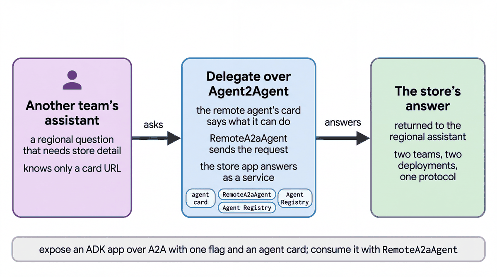

# Delegate to another team's agent over A2A

| | |
|-|-|
| Author(s) | [Matt Robinson](https://github.com/mr394729) |

## Overview

A regional operations desk, built by one team, hands store questions to the store operations agent, built by another team, over the Agent2Agent (A2A) protocol. The desk knows only the store agent's card URL; it imports none of its tools, prompts or guardrails.

In this quickstart, you learn:

- How to serve an ADK agent over the Agent2Agent (A2A) protocol with an agent card
- How `RemoteA2aAgent` lets one team's agent hand work to another team's agent
- What travels between the two agents, and what stays with each team

## Architecture



| Component | Owner | What it does |
|---|---|---|
| `server/cymbal_store_ops/` | Store operations team | Re-exports the store agent from `agents/cymbal_store_ops` and adds `agent.json`, the agent card |
| `adk api_server --a2a` | Store operations team | Serves every folder that has a card at `/a2a/<app>/.well-known/agent-card.json`, with the A2A endpoint |
| `a2a_agent` (`LlmAgent`) | Regional team | The regional desk; transfers store questions to its one sub-agent |
| `cymbal_store_ops_remote` (`RemoteA2aAgent`) | Regional team | A sub-agent built from the card URL |

## What the agent does

For a question about one store, the desk transfers to `cymbal_store_ops_remote`. ADK sends the message to the store agent's A2A endpoint and relays the answer. The employee id travels in the message, because the store agent signs the caller in with it. `STORE_OPS_A2A_URL` points the desk at a deployed store agent instead of `http://localhost:8002`.

## Prerequisites

- The [workshop setup](../../SETUP.md): a Google Cloud project, Application Default Credentials, and `GOOGLE_CLOUD_PROJECT` and `WORKSHOP_NAMESPACE` in `.env`.
- The store data loaded in your namespace (notebook `01_store_data.ipynb`).

## Run the agent

### In the notebook

Open [walkthrough.ipynb](walkthrough.ipynb) in Jupyter, VS Code or Colab Enterprise and run the cells in order.

### In the ADK developer UI

In one terminal, serve the store agent over A2A on port 8002:

```bash
uv run adk api_server --a2a quickstarts/12-a2a-agent/server --port 8002
```

In a second terminal, from the repository root, copy the quickstart into a folder that the ADK developer UI can load, then start the UI:

```bash
uv run python scripts/quickstart_apps.py 12-a2a-agent
uv run adk web build/quickstart_apps --port 8001
```

Open http://localhost:8001, choose `qs_12_a2a_agent`, and send:

```text
I'm U-M014, the Naperville store manager. Why is Lumière Hydra Cream flagged?
```

The Events tab shows the transfer to `cymbal_store_ops_remote` and the store agent's answer: nothing on the shelf, 7 in the backroom, a backroom check.

## Test the agent

The unit tests check the tools and the agent's configuration without calling the model:

```bash
uv run pytest quickstarts/12-a2a-agent/tests --import-mode=importlib
```

The evaluation set in `eval/` runs the agent against reference conversations with the ADK evaluator:

```bash
uv run python scripts/eval_quickstarts.py --only 12
```

The evaluation starts the A2A server itself.

## Clean up

Stop both terminals with Ctrl+C. Nothing is created in the cloud.

## Learn more

- [ADK with the Agent2Agent protocol](https://adk.dev/a2a/)
- [Agent Registry](https://docs.cloud.google.com/agent-registry/overview)
